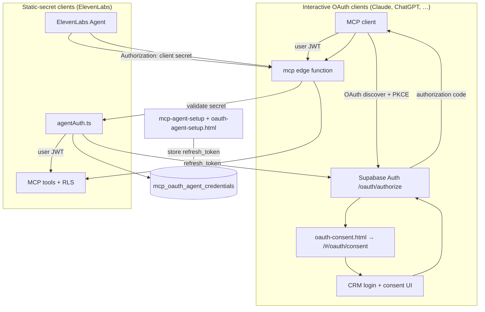

# MCP OAuth & Agent Gateway

This document explains the MCP authentication work in Atomic CRM: what was built, why each piece exists, and how to configure it in production.

Atomic CRM exposes CRM data to AI assistants via an [MCP](https://modelcontextprotocol.io/) server (`supabase/functions/mcp`). That server must know **which CRM user** is calling so Row Level Security (RLS) applies correctly. Different AI products authenticate in different ways, so the implementation supports **two paths** to the same MCP endpoint.

---

## The problem

1. **MCP requires a user identity**  
   Tools run SQL against Postgres with RLS. The bearer token must be a Supabase user JWT with a `sub` claim (auth user id)—not the anon key, not the service role key.

2. **OAuth-capable clients (Claude, ChatGPT, VS Code, Claude Code)**  
   These speak [Supabase OAuth 2.1](https://supabase.com/docs/guides/auth/oauth-server/oauth-flows): dynamic client registration, authorization code + **PKCE**, refresh tokens. The user logs into the CRM and approves consent in the browser.

3. **Static-secret clients (ElevenLabs Agents)**  
   ElevenLabs MCP integration accepts a **fixed Secret Token** on each request. It does **not** run an interactive OAuth flow and does **not** support Supabase’s `client_credentials` grant. Pasting a user JWT into ElevenLabs expires in ~1 hour.

4. **The CRM is a hash-router SPA on Vercel**  
   Supabase OAuth must redirect to real static HTML files at the app root. Redirecting to `/#/…` from Supabase’s authorization path breaks asset loading and login/consent flows.

The solution is: **OAuth consent for interactive clients**, plus an **agent gateway** that accepts a static OAuth app client secret and exchanges a stored refresh token for fresh user JWTs server-side.

---

## Architecture at a glance



---

## Two ways to connect

| | **OAuth clients** | **Agent gateway (ElevenLabs)** |
|---|-------------------|--------------------------------|
| **Examples** | Claude, ChatGPT, VS Code, Claude Code | ElevenLabs Agents |
| **Credential** | User session via OAuth (auto-refresh) | OAuth app **client secret** (fixed) |
| **Setup** | Add MCP URL in client; user approves consent | One-time admin bootstrap + Secret Token in ElevenLabs |
| **MCP URL** | `https://<project>.supabase.co/functions/v1/mcp` | Same |

Both hit the same `mcp` function. After authentication, requests use the **same CRM user’s** JWT and RLS rules.

---

## Repository components

### MCP server

| Path | Role |
|------|------|
| `supabase/functions/mcp/index.ts` | MCP tools (`get_schema`, `query`, `mutate`), streamable HTTP transport, auth gate |
| `supabase/functions/mcp/agentAuth.ts` | Accepts OAuth app client secret OR user JWT; refreshes agent access token |
| `supabase/functions/mcp/oauthToken.ts` | Token exchange / refresh with Supabase (`client_secret_basic`) |
| `supabase/functions/mcp/validateSql.ts` | SQL safety for read/write tools |

### Agent bootstrap (ElevenLabs path)

| Path | Role |
|------|------|
| `supabase/migrations/20260601120000_mcp_oauth_agent_credentials.sql` | Table for stored refresh tokens |
| `supabase/functions/mcp-agent-setup/index.ts` | Admin API: GET status, POST refresh token (or auth code), DELETE |
| `public/oauth-agent-setup.html` | Browser UI: PKCE authorize → store refresh token |
| `public/auth-callback.html` | OAuth redirect target; completes agent setup when `?code=` is present |

### OAuth consent (Claude path)

| Path | Role |
|------|------|
| `public/oauth-consent.html` | Static stub: redirects to `/#/oauth/consent?authorization_id=…` |
| `src/components/supabase/oauth-consent-page.tsx` | Consent UI, login redirect, approve/deny |
| `src/components/atomic-crm/providers/supabase/authProvider.ts` | Skips forced login redirect on `#/oauth/consent` |

### Config

| Path | Role |
|------|------|
| `supabase/config.toml` | `[auth.oauth_server]` authorization path; `[functions.mcp-agent-setup] verify_jwt = false` |
| `vite.config.ts` | PWA `navigateFallbackDenylist` for static OAuth HTML files |

---

## Why each static HTML file exists

The CRM uses **hash routing** (`/#/contacts`, etc.). Supabase OAuth redirects use **query strings** on real paths. Mixing them breaks the app.

| File | Why not only the SPA? |
|------|------------------------|
| **`oauth-consent.html`** | Supabase’s authorization path must be a normal URL. This file immediately redirects to the in-app consent route without loading JS bundles from the wrong path. |
| **`auth-callback.html`** | Supabase auth emails and OAuth apps use `/auth-callback.html`. Handles hash tokens for login and `?code=` for agent setup. |
| **`oauth-agent-setup.html`** | One-click admin bootstrap: PKCE authorize, callback handling, POST to `mcp-agent-setup`—without curl or browser console. |

---

## Why the agent gateway exists

ElevenLabs sends a **static** `Authorization` header on every MCP call. Supabase OAuth does **not** offer `client_credentials` for this use case.

The gateway pattern:

1. Admin completes a **one-time** OAuth login as the “agent user” (the CRM identity ElevenLabs should act as).
2. A **refresh token** is stored in `mcp_oauth_agent_credentials`.
3. ElevenLabs stores the OAuth app **client secret** as its Secret Token (never expires).
4. On each MCP request, `mcp` validates the secret, refreshes the user JWT, and runs tools as that user.

The client secret is only an **API key into your MCP layer**—not a Supabase admin key. Compromise rotates the OAuth app secret and re-bootstraps.

---

## Supabase dashboard configuration

Required for **interactive OAuth** (Claude, etc.):

| Setting | Location | Value |
|---------|----------|--------|
| OAuth 2.1 server | Authentication → OAuth Server | Enabled |
| Dynamic client registration | Same | Enabled |
| Authorization path | Same | `/oauth-consent.html` |
| Site URL | Authentication → URL Configuration | `https://your-crm-domain` (root, not `auth-callback.html`) |
| Redirect URLs | Same | Include `https://your-crm-domain/auth-callback.html` |

Required for **agent gateway**:

| Setting | Location | Value |
|---------|----------|--------|
| OAuth app | Authentication → OAuth Apps | Confidential app, `client_secret_basic`, **Public Client = off** |
| Redirect URI on that app | OAuth Apps | `https://your-crm-domain/auth-callback.html` |
| Edge secrets | Project secrets | `MCP_OAUTH_CLIENT_ID`, `MCP_OAUTH_CLIENT_SECRET` (from that OAuth app) |

Deploy functions after setting secrets:

```bash
npx supabase secrets set \
  MCP_OAUTH_CLIENT_ID="<oauth-app-client-id>" \
  MCP_OAUTH_CLIENT_SECRET="<oauth-app-client-secret>" \
  --project-ref <project-ref>

npx supabase functions deploy mcp mcp-agent-setup --project-ref <project-ref>
npx supabase db push   # if mcp_oauth_agent_credentials migration not yet applied
```

---

## One-time agent setup (ElevenLabs)

1. Log into the CRM as an **administrator**.
2. Open `https://your-crm-domain/oauth-agent-setup.html`.
3. Click **Connect agent user** and approve OAuth consent (this user is who the agent impersonates).
4. Confirm **“Agent connected.”**

Verify:

```bash
curl "https://<project>.supabase.co/functions/v1/mcp-agent-setup" \
  -H "Authorization: Bearer <admin-access-token>"
# → { "configured": true, "oauth_client_id": "..." }
```

---

## ElevenLabs configuration

Use **Add Custom MCP Server** (not OAuth2 Client Credentials under Auth Connections).

| Field | Value |
|-------|--------|
| **URL** | `https://<project>.supabase.co/functions/v1/mcp` |
| **Transport** | `STREAMABLE_HTTP` |
| **Secret Token** | OAuth app **client secret** only (raw string, **no** `Bearer` prefix) |
| **HTTP Headers** | Leave empty if using Secret Token |

ElevenLabs sends the Secret Token as the raw `Authorization` header value. The MCP function accepts both that form and `Authorization: Bearer <token>` (used by OAuth clients).

Do **not** use the publishable key, service role key, or a manually copied user JWT for production.

---

## Interactive client setup (Claude)

1. Add custom connector with MCP URL above.
2. Client discovers OAuth via `/.well-known/openid-configuration` and dynamic registration.
3. User is sent to `oauth-consent.html` → CRM consent → tokens issued.
4. MCP calls use the user’s JWT (refreshed by the client).

End-user documentation: [MCP Server](doc/src/content/docs/users/mcp-server.mdx) in the doc site.

---

## Troubleshooting

| Symptom | Likely cause |
|---------|----------------|
| Redirect to `localhost` during OAuth | Remote **Site URL** still points at localhost |
| `registration_endpoint_missing` | Dynamic client registration disabled |
| Asset 404s during consent | Authorization path not `/oauth-consent.html` |
| Consent/login loop | `authProvider` blocking `#/oauth/consent`; stale connector state in client |
| `invalid redirect_uri` (agent setup) | OAuth app missing `auth-callback.html` redirect URI |
| PKCE required on authorize | Normal for Supabase OAuth 2.1—use `oauth-agent-setup.html` (handles PKCE) |
| ElevenLabs **401** | Wrong secret, or `Bearer` duplicated in Secret Token + header |
| ElevenLabs **500** after fixing auth | Redeploy latest `mcp`; check edge function logs for `MCP request error` |
| `client_secret_basic` vs `client_secret_post` | OAuth app must use Basic; token helper uses Basic only |

Supabase edge logs: Dashboard → Edge Functions → `mcp` / `mcp-agent-setup`.

---

## Security notes

- **RLS always applies**—the agent runs as the bootstrapped CRM user, not as admin.
- **Rotate** the OAuth app client secret if leaked; re-run agent setup to refresh stored tokens.
- **`mcp_oauth_agent_credentials`** has RLS enabled with no policies—only the service role (edge functions) can read/write.
- **User deletion** is not supported in Atomic CRM; disable accounts instead.

---

## Related docs

- User guide: `doc/src/content/docs/users/mcp-server.mdx`
- Supabase remote setup: `doc/src/content/docs/developers/supabase-configuration.mdx`
- Supabase OAuth flows: [OAuth 2.1 flows](https://supabase.com/docs/guides/auth/oauth-server/oauth-flows)
- ElevenLabs MCP: [Model Context Protocol](https://elevenlabs.io/docs/eleven-agents/customization/tools/mcp)
