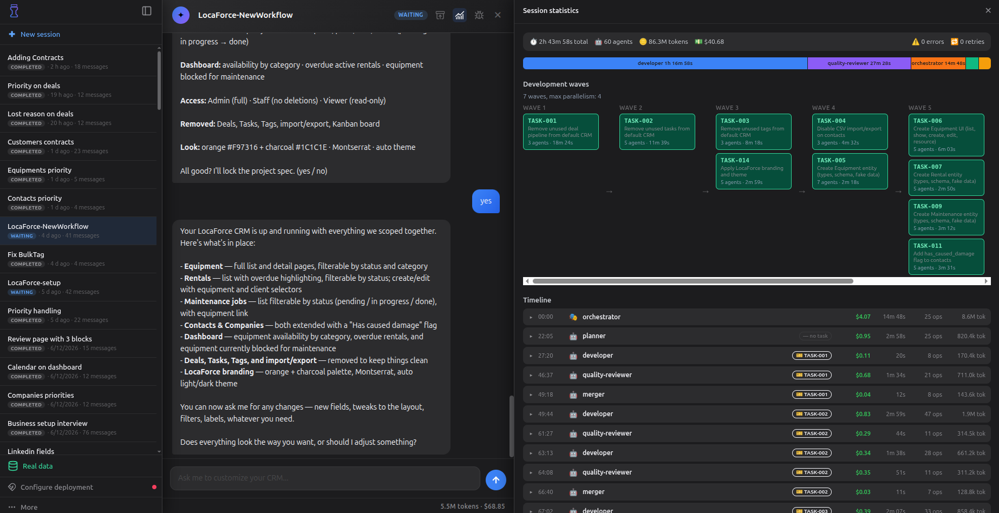

Atomic CRM ships an *agent harness*: a team of specialized Claude Code agents (planner, developer, reviewer, documenter) that turns a plain-English feature request into committed code through a deterministic pipeline. The agents share the same coding guidelines as the Atomic CRM core team, and add tools that cut token usage and speed up development.

## Prerequisites

- The [Claude Code CLI](https://docs.claude.com/en/docs/claude-code) installed and authenticated (an Anthropic API key or a Claude subscription).
- Project dependencies installed (`make install`).
- For full-stack runs only: a local Supabase instance up (`make start-supabase`).

## Usage

Start a Claude Code session as usual and ask for a new feature:

```
Create a new field for lost deal reasons.

# or

Build a CRM for my company Acme, a recruiting agency.
```

The harness starts immediately: Claude Code coordinates a team of specialized agents, depending on the complexity of the task. As the harness requires many permissions, you should turn on automatic permission mode to skip them.

<script src="https://asciinema.org/a/CcmbA8XrclBVK855.js" id="asciicast-CcmbA8XrclBVK855" data-speed="4" async="true"></script>

:::caution
The automatic permissions mode lets Claude Code run arbitrary commands on your machine and may modify or delete files. We advise you to run the harness in a sandboxed environment, such as a DevContainer (already configured in the repo) or a VM.
:::

:::tip
The subagents work in a temporary directory (in `/tmp/<repo-slug>`) to keep your main checkout clean. The harness eventually backports the changes to your checkout in a branch and merges it with the current branch.
:::

:::tip
Based on the complexity of the feature request, the main thread runs one of two workflows:

- **Simple**: a single cosmetic edit, a single-field change on an existing entity, or a filter reusing existing components. One developer agent, no planning overhead.
- **Complex**: everything else. The planner decomposes it into tickets; developers, reviewers, and the merger run as a coordinated wave.
:::

## Inspecting a Change

To see exactly what a harness session produced, use the diff command from within the session:

```
/harness-diff
```

It shows the net set of changes the session built, isolated from any other work on your branch. If you run it from a fresh session and several harness sessions exist, it lists them so you can pick the one to inspect.

## Reverting a Change

Because the merge is automatic, the harness may make a change you're not happy with. You can use the following command to revert the current session:

```
/harness-revert
```

This undoes everything the session merged into your branch and cleans up its temporary branches and worktrees. By default it targets the current session; if you run it from a fresh session and several previous runs exist, it lists them and asks which to revert.

:::caution
`/harness-revert` undoes the session's changes by reverting its merge commits, so it is safe even when several sessions have landed on the same branch; it removes only the selected session's work, not the others'. Uncommitted local edits are stashed first (recover them with `git stash pop`).
:::

## Disabling the Harness

Claude Code may use the harness even though you didn't ask for it. If you don't want to use it, you can opt out in your request. For instance:

```
Create a new field for lost deal reasons #no-harness

## or

Create a new field for lost deal reasons without the agent team

## or

Create a new field for lost deal reasons, skipping the agent team
```

The main thread then implements the change itself, no specialized agents. Add *"no-harness for this session"* to keep it off for the whole session.

## Monitoring a Session

The harness writes a detailed trace of every agent, hook, and ticket. Three commands let you follow it:

```sh
make watch                  # live monitor of the most recent session
make monitor                # one-shot summary of the most recent session
make monitor SESSION=<id>   # summary of a specific session
make sessions               # list known sessions, newest first
```

`make watch` re-renders a live view of the active agents, hook activity, and ticket statuses, useful to keep open in a second terminal while a COMPLEX session runs. `make monitor` prints the same information as a single snapshot.

<script src="https://asciinema.org/a/uyaoxIH5m5QdOcbZ.js" id="asciicast-uyaoxIH5m5QdOcbZ" data-speed="4" async="true"></script>


## CRM Builder: A Visual, Ready-Made Environment

[**CRM Builder**](https://github.com/marmelab/crm-builder) wraps the same harness in a containerized, browser-based environment, with no local setup. It adds:

- A containerized environment so you can run the harness without security concerns.
- A pre-installed toolchain, no need to set up Claude Code, Node, or Supabase yourself.
- A live preview of the CRM, updated as the harness applies your changes.
- A session dashboard to follow each run's agents and progress.
- Demo and full-stack mode switching from the UI.


