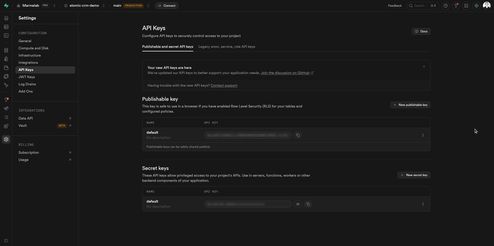
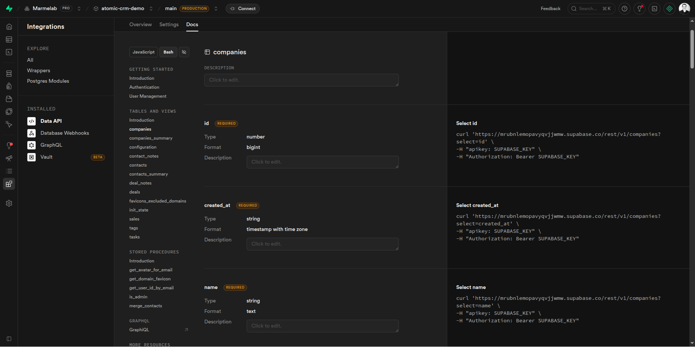

This document explains how to use the Atomic CRM API outside of Atomic CRM.
The API is built on top of Supabase, that is itself built on top of Postgrest. 
This means it is a REST API so it can be called from any programming language that can make HTTP requests.
See the [Supabase documentation](https://supabase.com/docs/guides/api) for more details.

## Authentication

To call the API, you need to pass an `apiKey` in the headers of your requests. The API key is the API key of your Supabase project, you can find it in the Supabase dashboard in the settings section.



You have two types of API keys in Supabase: the publishable API key, and the secret API key. You should use the publishable API key to call the API from your frontend or from any client side code, as it has limited permissions and does not allow to bypass RLS policies.
You should never use the secret API key in client side code, as it gives full access to your database and can be easily extracted from your code.
Only use the secret API key server side, and be sure to handle all authentication and security yourself if you go this way.

When calling protected endpoints with the publishable API key, You also need to authenticate the user and get a JWT token to be able to call the API.

Use the `/auth/v1/token` endpoint to authenticate a user and get a JWT token. You need to pass the user's email and password in the body of the request.

```sh
curl -X POST 'https://<instance_url>/auth/v1/token' \
  -H 'Content-Type: application/json' \
  -H 'apiKey: <your_api_key>' \
  -d '{
    "email": "user@email.con"
    "password": "user_password"
  }'
```

You then need to pass the JWT token in the `Authorization` header of your requests, with the `Bearer` scheme.

Example to get the list of contacts:

```sh
curl -X GET 'https://<instance_url>/rest/v1/contacts' \
  -H 'Content-Type: application/json' \
  -H 'apiKey: <your_publishable_api_key>' \
  -H 'Authorization: Bearer <your_jwt_token>'
```


## API Endpoints

The API endpoints are generated from the database schema.

You can see the [automatically generated documentation](https://supabase.com/dashboard/project/_/api) for your Atomic CRM Supabase project to see all the available endpoints and their parameters.
You can see how to call each endpoint either with the supabase client, or bash (curl).



As a quick preview here is a list of the main supabase auth endpoints you are most likely to use for authentication:

- `POST /auth/v1/signup`: to create a new user and get a JWT token.
- `POST /auth/v1/token`: to authenticate a user and get a JWT token.
- `POST /auth/v1/logout`: to log out the authenticated user.
- `GET /auth/v1/user`: to get the authenticated user information.

See the [Your supabase project's API documentation](https://supabase.com/dashboard/project/_/integrations/data_api/docs?page=users-management) for all the possible endpoints.

And here is the list of all the atomic crm specific endpoints:

- `GET /rest/v1/companies`: to get the list of companies.
- `POST /rest/v1/companies`: to create a new company.
- `GET /rest/v1/companies/{id}`: to get a company by id.
- `PATCH /rest/v1/companies/{id}`: to update a company by id
- `DELETE /rest/v1/companies/{id}`: to delete a company by id

- `GET /rest/v1/contacts_summary`: to get the list of contacts with their company name and number of tasks.

- `GET /rest/v1/configuration`: to get the configuration of the CRM, including the custom fields.

- `GET /rest/v1/contacts`: to get the list of contacts.
- `POST /rest/v1/contacts`: to create a new contact.
- `GET /rest/v1/contacts/{id}`: to get a contact by id.
- `PATCH /rest/v1/contacts/{id}`: to update a contact by id
- `DELETE /rest/v1/contacts/{id}`: to delete a contact by id.

- `GET /rest/v1/tasks`: to get the list of tasks.
- `POST /rest/v1/tasks`: to create a new task.
- `GET /rest/v1/tasks/{id}`: to get a task by id.
- `PATCH /rest/v1/tasks/{id}`: to update a task by id
- `DELETE /rest/v1/tasks/{id}`: to delete a task by id


- `GET /rest/v1/companies_summary`: to get the list of companies with the number of contacts and tasks.

- `GET /rest/v1/deals`: to get the list of deals.
- `POST /rest/v1/deals`: to create a new deal.
- `GET /rest/v1/deals/{id}`: to get a deal by id.
- `PATCH /rest/v1/deals/{id}`: to update a deal by id
- `DELETE /rest/v1/deals/{id}`: to delete a deal by id

- `GET /rest/v1/deal_notes`: to get the list of deal notes.
- `POST /rest/v1/deal_notes`: to create a new deal note.
- `GET /rest/v1/deal_notes/{id}`: to get a deal note by id.
- `PATCH /rest/v1/deal_notes/{id}`: to update a deal note by id
- `DELETE /rest/v1/deal_notes/{id}`: to delete a deal note by id

- `GET /rest/v1/contact_notes`: to get the list of contact notes.
- `POST /rest/v1/contact_notes`: to create a new contact note.
- `GET /rest/v1/contact_notes/{id}`: to get a contact note by id.
- `PATCH /rest/v1/contact_notes/{id}`: to update a contact note by id
- `DELETE /rest/v1/contact_notes/{id}`: to delete a contact note by id

Supabase use Postgrest so the route supports all the query parameters supported by Postgrest.

To filter the list of contacts by company name, you can use the following query:

```
GET /rest/v1/contacts?company_name=eq.Acme
```

Or to get the list of tasks that are due after today, you can use the following query:

```
GET /rest/v1/tasks?due_date=gt.2024-01-01
```

To only get the name and email of the contacts, you can use the following query:

```
GET /rest/v1/contacts?select=name,email
```

Note: For more details on the available query parameters, and other possibilities (like calling functions) check the [Postgrest documentation](https://postgrest.org/en/stable/references/api.html).

## Example: Authenticating and finding a contact by email and then adding a note to this contact

Let's say you want to integrate the CRM with another tool, like one where you have a list of contacts that send you messages, and you want to automatically add these messages as notes to the corresponding contact in the CRM.
You can create a widget that listens to incoming messages, and for each message, it calls the API to find the contact by email, and then adds a note to this contact with the content of the message.

First you need to retrieve the API key of your Supabase project, you can find it in the Supabase dashboard in the settings section.

Here I'm using JavaScript and the native `fetch` API to make the HTTP requests, but you can use any programming language and any HTTP client.
You could also use the supabase client library to do it, but here we want to show how to do it without the supabase client library, so we are making the HTTP requests directly.
I'm also doing it in a single function for simplicity.
In a real application, you probably would do this in multiple functions, and handle errors and edge cases (like the contact not being found) properly.
How to intercept incoming messages and trigger this function is out of the scope of this document.

```js
async function addMessageAsNoteToContact({
  message,
  email,
  password,
  apiKey
}) {
  // Step 1: Authenticate the user of the widget and get a JWT token
  const authResponse = await fetch('https://<instance_url>/auth/v1/token', {
    method: 'POST',
    headers: { 'Content-Type': 'application/json', apiKey },
    body: JSON.stringify({ email, password }),
  });
  const authData = await authResponse.json();
  const jwtToken = authData.access_token;

  // Step 2: Find the contact by email
  const contactsResponse = await fetch(
    `https://<instance_url>/rest/v1/contacts?email=eq.${
      encodeURIComponent(message.email)
    }`,
    {
      headers: {
        apiKey,
        Authorization: `Bearer ${jwtToken}`
      },
    }
  );
  const contacts = await contactsResponse.json();

  if (contacts.length === 0) {
    console.log(`No contact found with email ${message.email}`);
    return;
  }

  const contact = contacts[0];

  // Step 3: Add a note to this contact with the content of the message
  await fetch('https://<instance_url>/rest/v1/contact_notes', {
    method: 'POST',
    headers: {
      apiKey,
      Authorization: `Bearer ${jwtToken}`,
      'Content-Type': 'application/json',
    },
    body: JSON.stringify({
      contact_id: contact.id,
      text: message.content,
    }),
  });

  console.log(
    `Added note to contact ${contact.name} with email ${contact.email}`
  );
}
```
