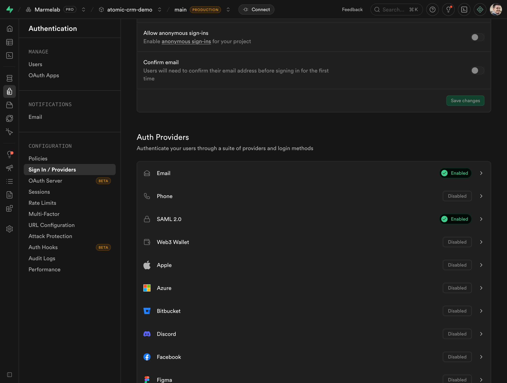
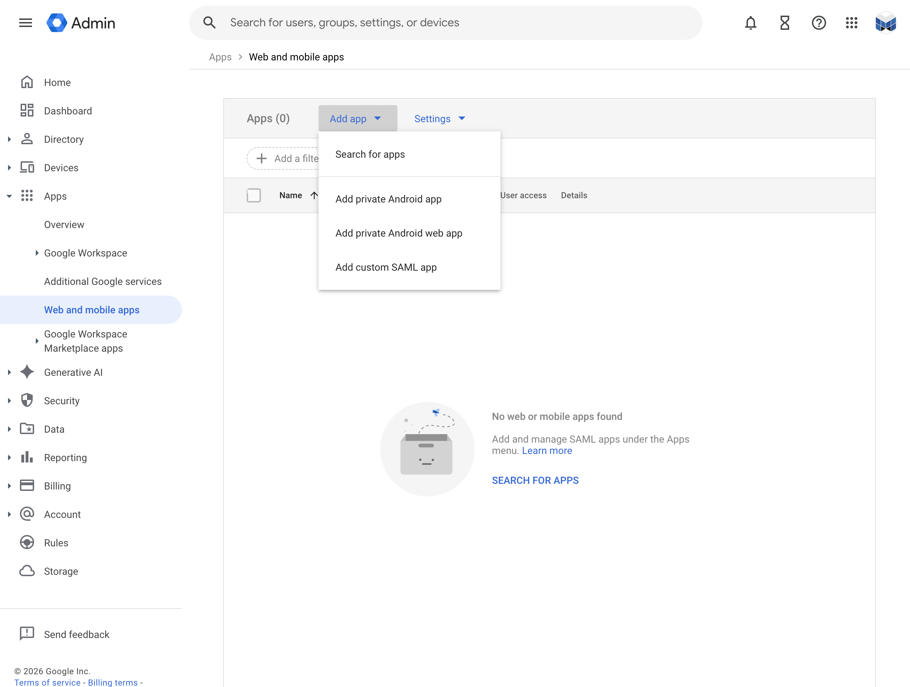
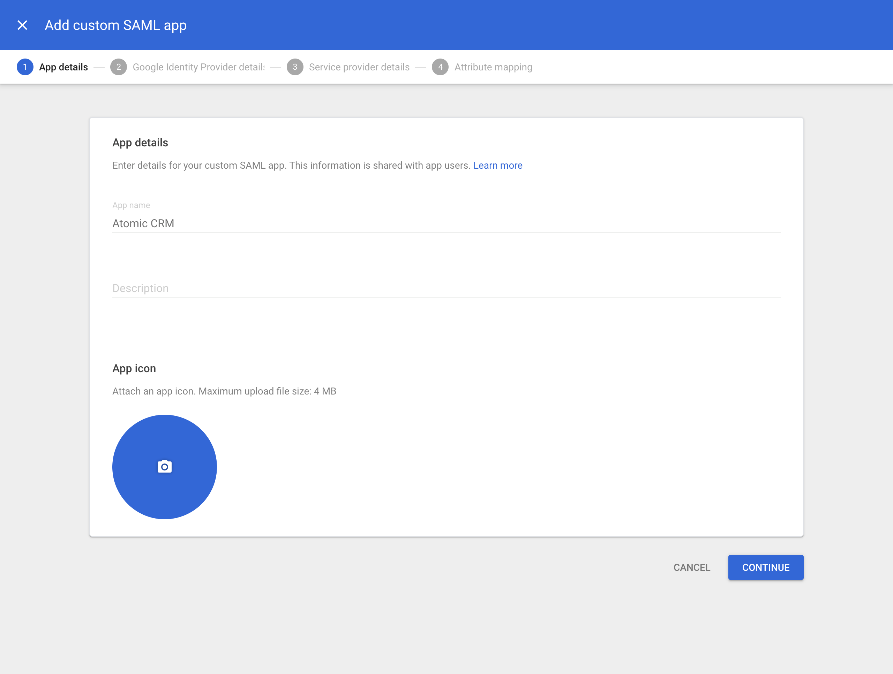
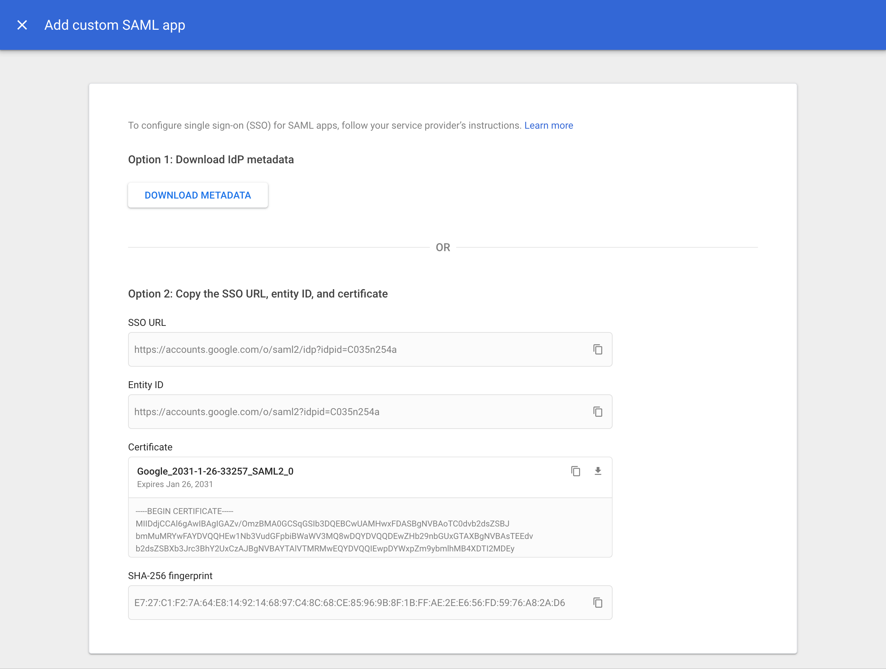
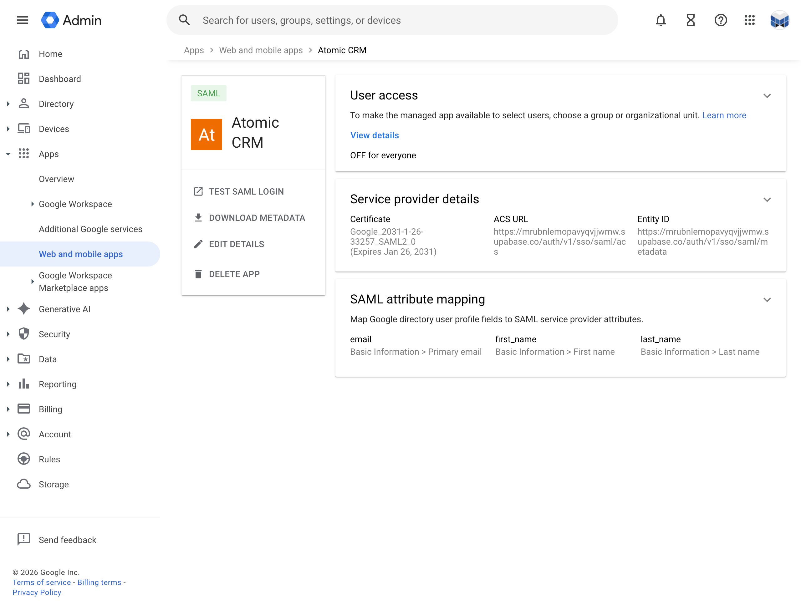

Atomic CRM supports SSO (Single Sign-On) authentication through SAML 2.0. This allows your users to authenticate using their existing credentials from an identity provider, such as Google Workspace, Okta, or Microsoft Azure AD.

## Setup SSO with Google Workspace

This section explains how to set up SSO with Google Workspace as the identity provider. The steps are similar for other identity providers, but the exact UI and terminology may differ.

### Enable SSO in Supabase

In _Authentication > Sign in / Providers_, enable _SAML 2.0_:



### Create Application in Google Workspace

1. **Open your [Google Workplace Console](https://admin.google.com/) and go to _Apps > Web and mobile apps_**

   

2. **Choose to add custom SAML app**

   

3. **Fill out app details**

   The information you enter here is for visibility into your Google Workspace. You can choose any values you like. _Atomic CRM_ as a name works well for most use cases. Optionally enter a description and a logo.

   

4. **Download IdP metadata**
   
   This is a very important step. Click on _DOWNLOAD METADATA_ and save the file that was downloaded. You will need to upload this file later.
  
  

5. **Add service provider details**

   Fill out these service provider details on the next screen. Replace `<project>` with your Supabase project identifier in the URLs below.

   | Detail | Value |
   |--------|-------|
   | ACS URL | https://&lt;project&gt;.supabase.co/auth/v1/sso/saml/acs |
   | Entity ID | https://&lt;project&gt;.supabase.co/auth/v1/sso/saml/metadata |
   | Start URL | Your application URL (optional) |
   | Name ID format | EMAIL |
   | Name ID | Basic Information > Primary email |

   

6. **Configure attribute mapping**

   To properly map the identity details to the sales fields in Atomic CRM, add the following mappings:

   | Google Directory attributes | App attributes |
   |-----------------------------|----------------|
   | Primary email | `email` |
   | First name | `first_name` |
   | Last name | `last_name` |

   

7. **Configure user access**
   
   You can configure which Google Workspace user accounts will get access to Atomic CRM. This is important if you wish to limit access to your software engineering teams.

   You can configure this access by clicking on the _User access_ card (or down-arrow). Follow the instructions on screen.
   

### Register SSO Provider in Supabase

Save the following JSON in a `mapping.json` file:

```json title="mapping.json"
{
  "keys": {
    "email": {
      "name": "email"
    },
    "first_name": {
      "name": "first_name"
    },
    "last_name": {
      "name": "last_name"
    }
  }
}
```

The, run the following command where the `metadata.xml` file is the file you downloaded at _step 4_ and `mapping.json` the file you created just now. Replace `<your-project>` with your Supabase project identifier and `company.com` with your company domain:

```sh
npx supabase sso add --type saml --project-ref <your-project> \
  --metadata-file /path/to/saml/metadata.xml \
  --attribute-mapping-file /path/to/mapping.json \
  --domains company.com
```

### Enable Google Workspace SSO in Login Page

Provide the `VITE_GOOGLE_WORKPLACE_DOMAIN` environment variable, for instance by adding it to your `.env` file:
```sh title=".env"
...
VITE_GOOGLE_WORKPLACE_DOMAIN=company.com
```

You can optionally disable email/password authentication by providing the `VITE_DISABLE_EMAIL_PASSWORD_AUTHENTICATION` environment variable:
```sh title=".env"
...
VITE_DISABLE_EMAIL_PASSWORD_AUTHENTICATION=true
```
