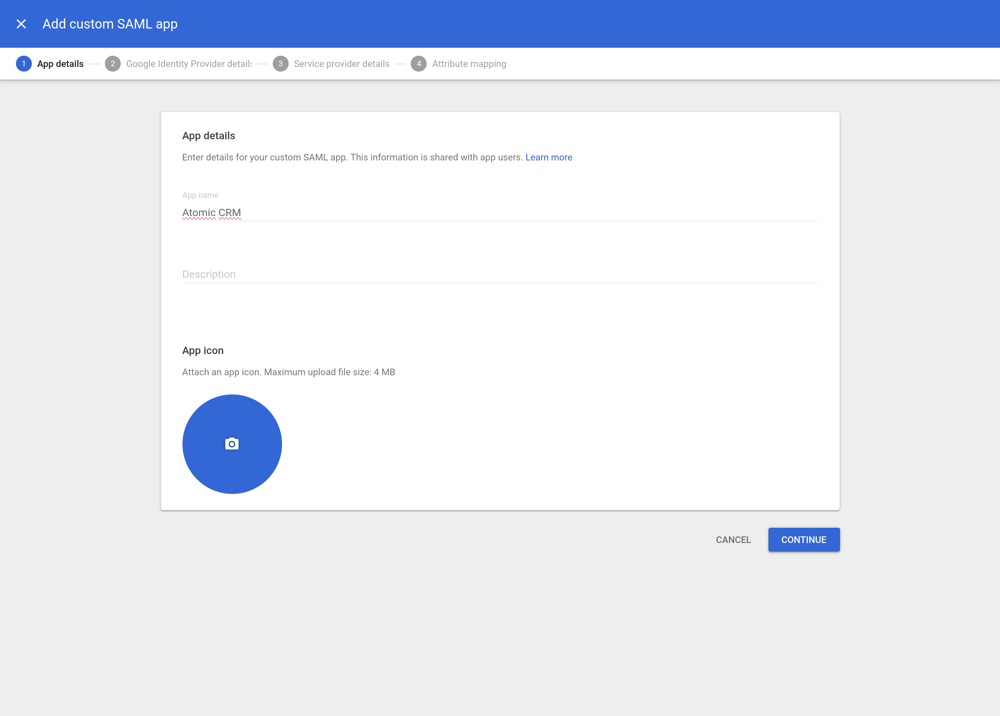
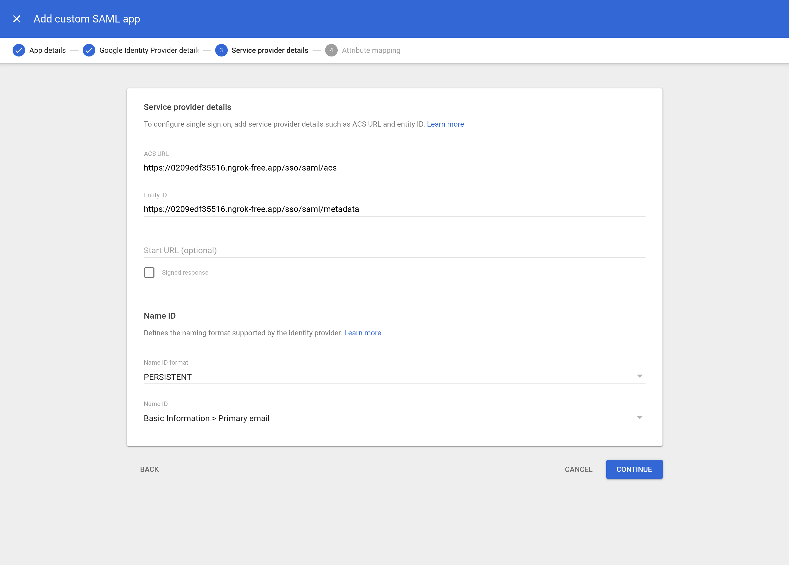
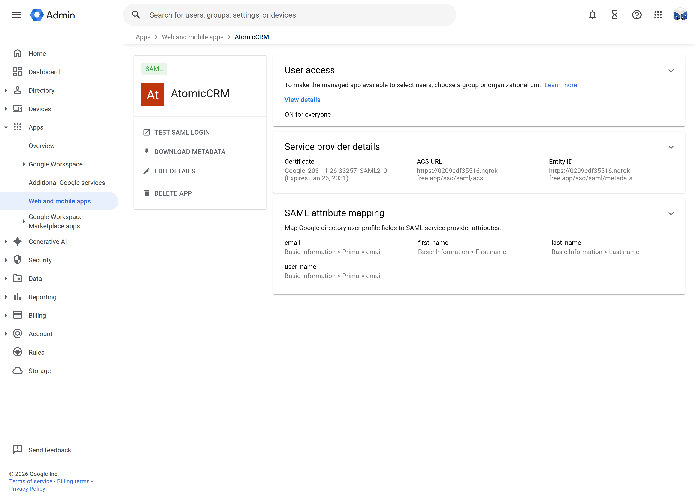
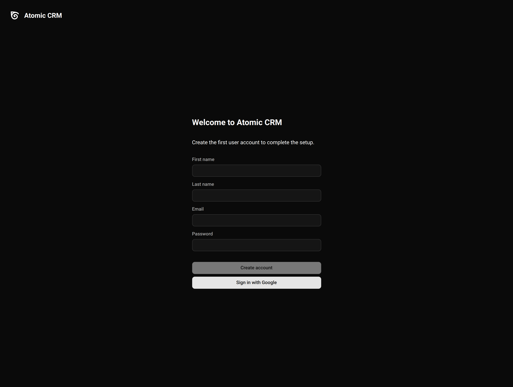

Atomic CRM supports SSO out of the box without additional costs. To enable it, your Supabase instance must support SSO too. There are two ways to support SSO on Supabase:
- [Enable SSO](https://supabase.com/docs/guides/auth/enterprise-sso/auth-sso-saml) on your hosted instance at Supabase, which requires a subscription to their pro, team or enterprise plans (https://supabase.com/pricing#compare-plans)
- Self-hosting Supabase and configure SSO yourself

## Google Workspace SSO On a Self Hosted Supabase Instance

> This section is a modified version of the [Enabling custom SAML SSO on Your Self-hosted Supabase](https://calvincchan.com/blog/self-hosted-supabase-enable-sso) article by _Calvin C. Chan_.

You'll need to have a self-hosted Supabase instance running. The rest of this guide will assume you followed the [Self Hosting Documentation](./self-hosting). Make sure you change the ports and urls according to your configuration.

Besides, this instance must be publicly accessible with an HTTPS url. We'll use [ngrok](https://ngrok.com/) to test SSO with a local Supabase instance.

### Generate private key and add it to .env file

First, run the following command to generate a private key. A private key is required for the SAML Service Provider to sign the SAML response.

```sh
openssl genpkey -algorithm rsa -outform DER -out saml_private_key.der
```
Then, convert it into base64 format and copy the output to .env file.

```sh
base64 -i saml_private_key.der
```

Finally, put it in `.env` file at the same directory as the Supabase `docker-compose.yaml` file. If you followed our [Self Hosting Documentation](./self-hosting), it's the `./docker/.env` file:

```
GOTRUE_SAML_ENABLED=true
GOTRUE_SAML_PRIVATE_KEY=(your private key in base64)
```

### Update docker-compose.yaml to enable SAML

Next, we need to pass the new env vars to the docker container that runs the GoTrue auth service. Add the following to the Supabase `docker-compose.yaml`:

```yaml
auth:
   container_name: supabase-auth
   image: supabase/gotrue:v2.99.0
   ...
   environment:
     ...
     GOTRUE_SAML_ENABLED: ${GOTRUE_SAML_ENABLED}
     GOTRUE_SAML_PRIVATE_KEY: ${GOTRUE_SAML_PRIVATE_KEY}
```

### Expose the SAML endpoints in Kong

We need to expose two SAML endpoints in Kong. The `kong.yml` file is located at `/docker/volumes/api/kong.yml`. Add the following routes at the end of the file:

```yaml
  ## SSO routes
  - name: auth-v1-open-sso-acs
    url: "http://auth:9999/sso/saml/acs"
    routes:
      - name: auth-v1-open-sso-acs
        strip_path: true
        paths:
          - /auth/v1/sso/saml/acs
          - /sso/saml/acs
    plugins:
      - name: cors
  - name: auth-v1-open-sso-metadata
    url: "http://auth:9999/sso/saml/metadata"
    routes:
      - name: auth-v1-open-sso-metadata
        strip_path: true
        paths:
          - /auth/v1/sso/saml/metadata
    plugins:
      - name: cors
  - name: auth-v1-open
    url: http://auth:9999/verify
    routes:
      - name: auth-v1-open
        strip_path: true
        paths:
          - /auth/v1/verify
    plugins:
      - name: cors
  - name: auth-v1-open-callback
    url: http://auth:9999/callback
    routes:
      - name: auth-v1-open-callback
        strip_path: true
        paths:
          - /auth/v1/callback
    plugins:
      - name: cors
  - name: auth-v1-open-authorize
    url: http://auth:9999/authorize
    routes:
      - name: auth-v1-open-authorize
        strip_path: true
        paths:
          - /auth/v1/authorize
    plugins:
      - name: cors
```

### Test Supabase

Restart the containers by `docker-compose down; docker-compose up`. To test if the SAML endpoints are working, you can use the following API call:

```sh
API_KEY=(your supabase service role key);
curl -X GET http://localhost:8000/auth/v1/settings \
  -H 'APIKey: '"$API_KEY"'' \
  -H 'Authorization: Bearer '"$API_KEY"'';
```

You should be able to see `"saml_enabled": true` in the output:

```json
{
  "external": {
    "apple": false,
    "azure": false,
    "bitbucket": false,
    ...
  },
  "disable_signup": false,
  "mailer_autoconfirm": false,
  "phone_autoconfirm": true,
  "sms_provider": "",
  "mfa_enabled": false,
  "saml_enabled": true
}
```

### Add Atomic CRM To Google Workplace

1. Open the Google Workspace web and mobile apps console
  

2. Choose to add custom SAML app

   From the Add app button in the toolbar choose Add custom SAML app.
  

3. Fill out app details
  
   The information you enter here is for visibility into your Google Workspace. You can choose any values you like. **Atomic CRM** as a name works well for most use cases. Optionally enter a description.
  

4. Download IdP metadata

   This is a very important step. Click on DOWNLOAD METADATA and save the file that was downloaded. You will need to upload this file later.
  
  
5. Add service provider details

   Here you'll need to provide URLs for your publicly accessible Supabase instance. As explained above, we use ngrok:
    - ACS URL: `https://0209edf35516.ngrok-free.app/sso/saml/acs`
    - Entity ID: `https://0209edf35516.ngrok-free.app/sso/saml/metadata`
    - Name ID format: `PERSISTENT`
    - Name ID: _Basic Information > Primary email_
    
    

6. Configure attribute mapping
   
   Attribute mappings allow Supabase to get information about your Google Workspace users on each login.
  

7. Configure user access

   You can configure which Google Workspace user accounts will get access to Supabase. This is important if you wish to limit access to your software engineering teams.
   
   You can configure this access by clicking on the _User access_ card (or down-arrow). Follow the instructions on screen.
  

### Add SAML identity provider to Supabase

To add the SAML identity provider to Supabase, you'll need to convert the metadata XML file downloaded before as JSON escaped single line:
- replace all quotes with `\"`
- replace all new lines with `\n`

Once you have it, use the following command:

```sh
API_KEY=(your supabase service role key);
curl -X POST http://localhost:8000/auth/v1/admin/sso/providers \
  -H 'APIKey: '"$API_KEY"'' \
  -H 'Authorization: Bearer '"$API_KEY"'' \
  -H 'Content-Type: application/json' \
  -d '{
    "type": "saml",
    "metadata": "(paste the SAML Metadata line you prepared here)",
    "domains": ["yourdomain.com"],
    "attribute_mapping": {
      "keys": {
        "first_name": { "name": "first_name" },
        "last_name": { "name": "last_name" },
        "email": { "name": "email" }
      }
    }
  }';
```

To verify if the SAML identity provider is added successfully, you can run the following command:

```sh
API_KEY=(your supabase service role key);
curl -X GET http://localhost:8000/auth/v1/admin/sso/providers \
  -H 'APIKey: '"$API_KEY"'' \
  -H 'Authorization: Bearer '"$API_KEY"'' \
```

The output should look like:

```json
{
  "items": [
    {
      "id": "2bc1c44f-ccea-4289-a736-4d6d333d4af0",
      "saml": {
        "entity_id": "urn:yourdomain.com",
        "attribute_mapping": {
          "keys": {
            "first_name": { "name": "first_name" },
            "last_name": { "name": "last_name" },
            "email": { "name": "email" }
          }
        }
      },
      "domains": [{ "domain": "yourdomain.com" }],
      "created_at": "2023-12-07T19:34:09.907022Z",
      "updated_at": "2023-12-07T19:34:09.907022Z"
    }
  ]
}
```

### Testing the SSO Integration

Update your Supabase `./docker/.env` file to set the `API_EXTERNAL_URL` to the same publicly accessible we used before (in our case the ngrok URL):

```sh
API_EXTERNAL_URL=https://0209edf35516.ngrok-free.app
```

Restart the containers by `docker-compose down; docker-compose up` and test the Supabase instance supports sign-in through SSO:

```sh
API_KEY=(your supabase service role key);
curl -X POST http://localhost:8000/auth/v1/sso \
  -H 'APIKey: '"$API_KEY"'' \
  -H 'Authorization: Bearer '"$API_KEY"'' \
  -H 'Content-Type: application/json' \
  -d '{
    "domain": "yourdomain.com",
    "skip_http_redirect": true
  }';
```

The output should be a JSON with a url property. This is the URL to redirect the user to the external SSO login screen.

```json
{
  "url": "https://dev-g8es4m0caprhrd4c.us.auth0.com/samlp/PU7tL448jcXfMpixiStfO3zzbmsBQktG?SAMLRequest=nJJPb9s8DIe%2FiqG7%2F8aNY6ExkDZ43wVIV69Jh2E3WmZirZbk..."
}
```

## Enabling SSO In Atomic CRM

To let users sign-in with SSO, modify your main app (`src/App.tsx`):

```jsx
const App = () => (
  <CRM sso={{ domain: "yourdomain.com", buttonLabel: "Sign in with Google" }} />
);
```


