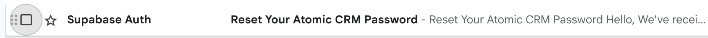
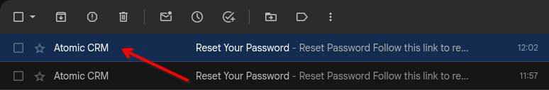
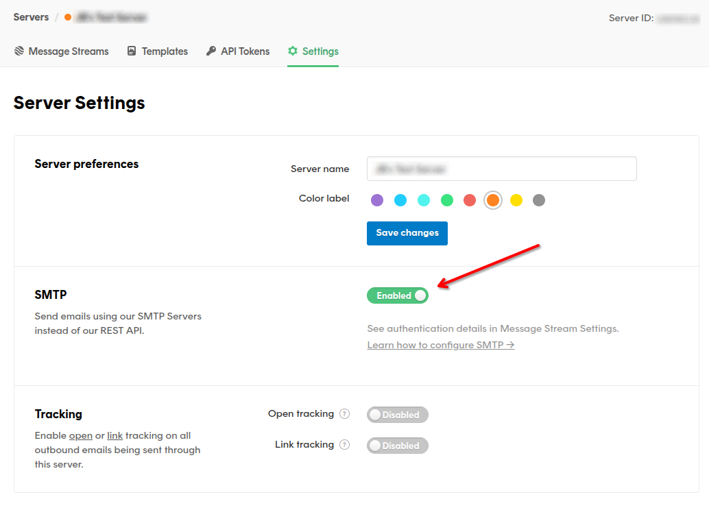
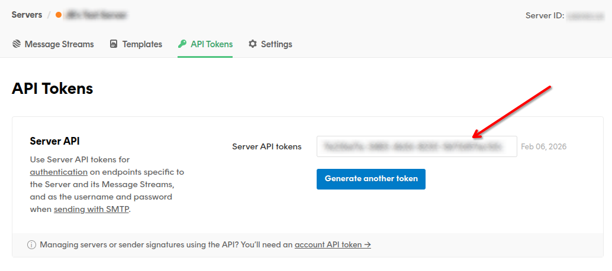
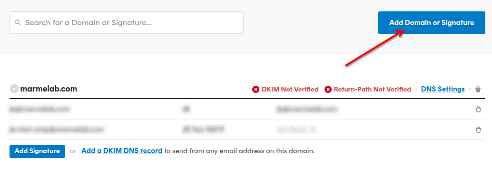
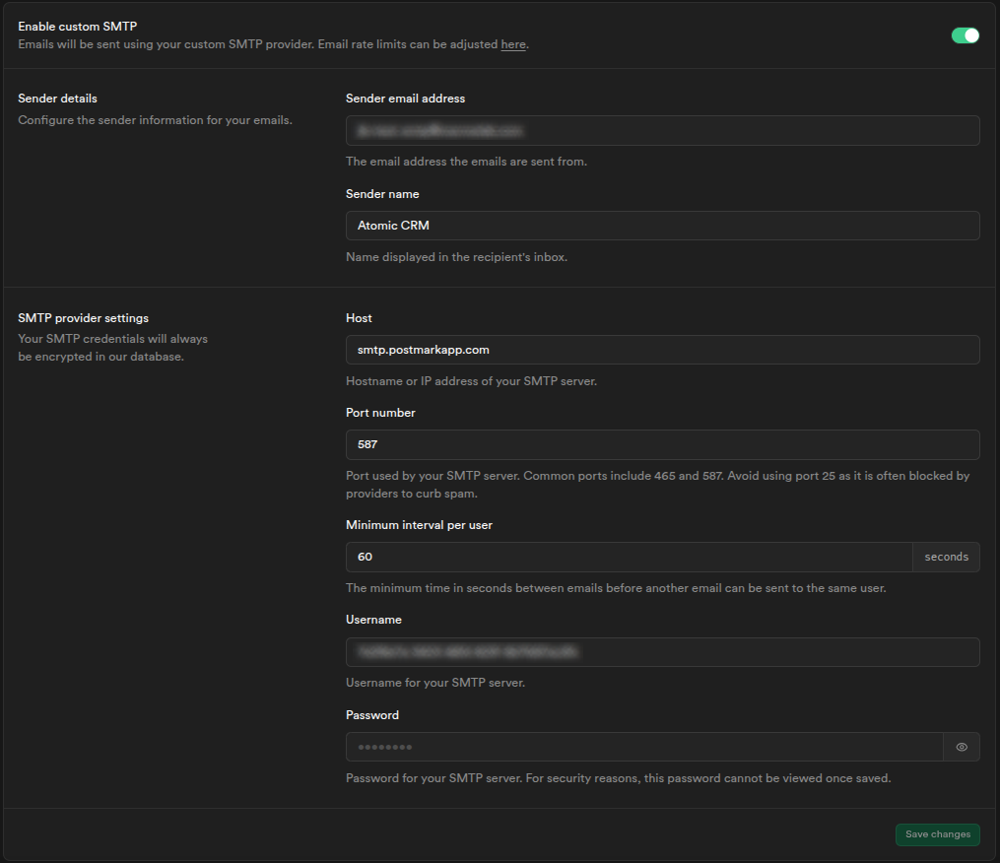

Atomic CRM uses Supabase as a backend. This document explains how to configure a remote Supabase instance hosted at [supabase.com](https://supabase.com/).

## Creating a Remote Supabase Instance

Atomic CRM comes with a CLI utility to create a backend instance on [supabase.com](https://supabase.com/):

```sh
make supabase-remote-init
```

The script will ask you for the Supabase instance name, create the database, apply the migrations and deploy the edge functions. Finally, it will create a `.env.production.local` file with your remote Supabase configuration.

The script cannot yet automate the configuration of the required SMTP provider on your Supabase instance. To do that, please follow the instructions detailed in the [Email Provider Setup](#email-provider-setup) section.

## Alternative: Using An Existing Supabase Instance

If you already created a project on [supabase.com](https://supabase.com/), you can configure the Atomic CRM frontend to use it.

First, log into your Supabase account:

```sh
npx supabase login
```

Now, link the local project to the Supabase instance. You'll be asked to enter the database password.

```sh
npx supabase link --project-ref ********************
```

Set up secrets for the Supabase instance (follow this [guide](https://supabase.com/docs/guides/api/api-keys#where-to-find-keys) to find your publishable key):

```sh
npx supabase secrets set SB_PUBLISHABLE_KEY=<publishable_key>
```

Then, apply the migrations and deploy the edge functions:

```sh
npx supabase db push
npx supabase functions deploy
```

Finally, add a `.env.production.local` file in the root directory with your remote Supabase credentials:

```sh
VITE_SUPABASE_URL=<instance_url>
VITE_SB_PUBLISHABLE_KEY=<instance_publishable_key>
```

Atomic CRM requires that you set up an email provider on your Supabase instance. If you don't have one yet, please follow the instructions detailed in the [Email Provider Setup](#email-provider-setup) section.

## Testing Production Mode

Before deploying the frontend code to production, you may want to test the local frontend code when connected to the remote Supabase instance.

To do so, call the following command:

```sh
make prod-start
```

You will be prompted to create the first production user.

Using a remote Supabase instance can be interesting if you deploy from your computer, or if you want to test your app with production data in production mode.

## Email Provider Setup

In order to support [the invitations workflow](../../users/user-management#adding-users) and the default email/password authentication (including password reset), Atomic CRM needs to be able to send emails from your Supabase instance.

By default, Supabase provides a simple SMTP server for all projects. But this server imposes a few important restrictions and is not meant for production use:

- It can only send messages to pre-authorized addresses
- It imposes significant rate-limits
- There is no SLA guarantee on message delivery or uptime

Besides, it doesn't allow you to customize the sender name, so all messages will be sent from `Supabase Auth` (see the [next section](#example-configuration-with-postmark) if you want to change that).



For all these reasons, it is recommended to use a [custom SMTP provider](https://supabase.com/docs/guides/auth/auth-smtp#how-to-set-up-a-custom-smtp-server).

A non-exhaustive list of services that work with Supabase Auth is:

- [Postmark](https://postmarkapp.com/developer/user-guide/send-email-with-smtp) (recommended if you also plan to use the [Inbound Email](../../users/inbound-email) feature)
- [Resend](https://resend.com/docs/send-with-supabase-smtp)
- [AWS SES](https://docs.aws.amazon.com/ses/latest/dg/send-email-smtp.html)
- [Twilio SendGrid](https://www.twilio.com/docs/sendgrid/for-developers/sending-email/getting-started-smtp)
- [ZeptoMail](https://www.zoho.com/zeptomail/help/smtp-home.html)
- [Brevo](https://help.brevo.com/hc/en-us/articles/7924908994450-Send-transactional-emails-using-Brevo-SMTP)

Once you've set up your account with an email sending service, head to the [Authentication settings page](https://supabase.com/dashboard/project/_/settings/auth) to enable and configure custom SMTP.

Once you save these settings, your project's Auth server will send messages to all addresses. To protect the reputation of your newly set up service a low rate-limit of 30 messages per hour is imposed. To adjust this to an acceptable value for your use case head to the [Rate Limits configuration page](https://supabase.com/dashboard/project/_/auth/rate-limits).

**Note:** Alternatively, you can also [set up an authentication hook](https://supabase.com/docs/guides/auth/auth-hooks/send-email-hook) to send the emails yourself.

### Example Configuration With Postmark

This section will walk you through the configuration of **Postmark** as a **custom SMTP provider** for **Supabase Auth**. This will notably allow you to customize the sender name of the authentication emails.



:::note
While the [Inbound Email](../../users/inbound-email) feature requires using Postmark, Supabase Auth can work with any SMTP provider. But this guide assumes you are using Postmark as your SMTP provider too, since it's the recommended provider for both features.
:::

**Step 1: Create a Postmark account and get your SMTP credentials**

You can use an existing Postmark account or [create a new one](https://account.postmarkapp.com/sign_up). The free tier allows you to send or receive up to 100 emails per month.

In your Server **Settings**, make sure **SMTP** is **enabled**.



Then, go to the **API Tokens** tab, and copy the **Server API token**.



**Step 2 (optional): Add new Domain or Signature**

If you are using Postmark in **Test Mode**, by default, it will only allow you to send emails from domains or email addresses that have been registered as **Sender Signatures** in your Postmark account. You can either add a new Sender Signature for the email address you want to send from, or add a new Domain if you want to send from any email address of that domain.



**Step 3: Configure Supabase Auth to use Postmark as a custom SMTP provider**

Go to the [Authentication settings page](https://supabase.com/dashboard/project/_/auth/smtp) of your Supabase project, and enable **Custom SMTP** with the following configuration:

| Field                     | Value                                                                   |
| ------------------------- | ----------------------------------------------------------------------- |
| Sender email address      | The email address you want to send from (e.g. `atomic-crm@company.com`) |
| Sender name               | The sender name you want to display in the emails (e.g. `Atomic CRM`)   |
| Host                      | `smtp.postmarkapp.com`                                                  |
| Port number               | `587`                                                                   |
| Minimum interval per user | You can keep the default value (60 seconds)                             |
| Username                  | Use the Server API token you copied in Step 1 as the username           |
| Password                  | Use the Server API token you copied in Step 1 as the password           |

:::tip
Check out the [Postmark documentation](https://postmarkapp.com/developer/user-guide/send-email-with-smtp) for alternative SMTP settings.
:::

:::tip
Use the `Sender name` field to customize the sender name of the authentication emails. It will override the default name set in Postmark if you have one.
:::



**Step 4: Make sure everything is working**

You can for instance click the "Forgot your password?" link on the login page to trigger a password reset email. If you receive the email with the correct sender name, then everything is working correctly!


## Setting The Login Callback

Atomic CRM uses Supabase's authentication system. When a user logs in, Supabase redirects them to an authentication callback URL that is handled by the frontend.

When developing with a local Supabase instance, the callback URL is already configured--you don't need to do anything.

When using a remote Supabase instance, you need to configure the callback URL as follows:

1. Go to the project dashboard at [supabase.com](https://supabase.com/).
2. Go to **Authentication** > **URL Configuration**.
3. Set up the callback URL of the production frontend in the **Site URL** field.

If you host Atomic CRM under the `https://example.com/atomic-crm/` URL, the callback URL should be `https://example.com/atomic-crm/auth-callback.html`.

## Customizing Email Templates

Atomic CRM uses Supabase to send authentication-related emails (confirm signup, reset password, etc).

When developing with a local Supabase instance, you test your custom mail templates via the [supabase TOML config](https://github.com/marmelab/atomic-crm/blob/main/supabase/config.toml) file. An example of a custom template has been done for the [recovery](https://github.com/marmelab/atomic-crm/blob/main/supabase/templates/recovery.html) email. Note that you will need to restart your supabase instance to apply the changes.

When using a remote Supabase instance, you can configure the email templates as follows:

1. Go to the project dashboard at [supabase.com](https://supabase.com/).
2. Go to **Authentication** > **Email Templates**.
3. Choose the template you want to change using the email template tabs.
4. Paste the template source code in the editor and save.

If you want more information on how to customize email templates, check the [Customizing Email Templates](https://supabase.com/docs/guides/cli/customizing-email-templates) documentation.

## Frequently Asked Questions

**I have a _Security Definer View_ error in _Security Advisor_**

This warning informs you that the `init_state` state view is public and can be called by everybody.

This view is required to test if the CRM has been setup correctly. It doesn't expose any data, so you can ignore the Security Advisor error.
