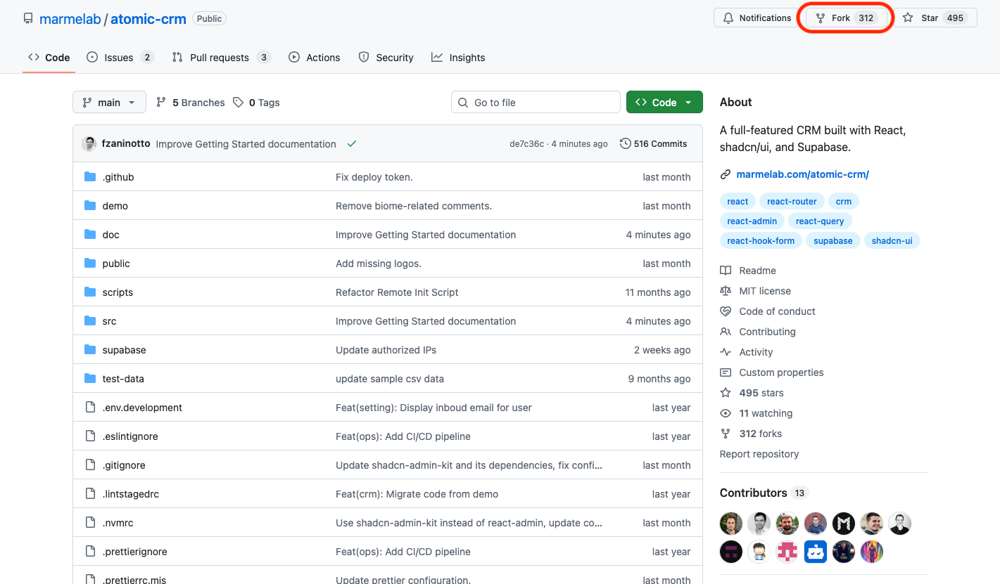
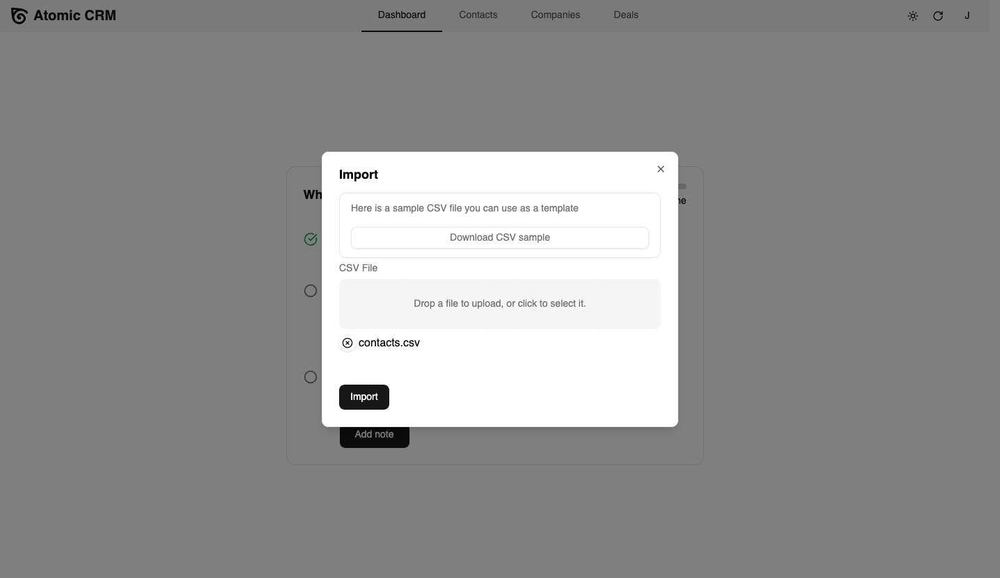
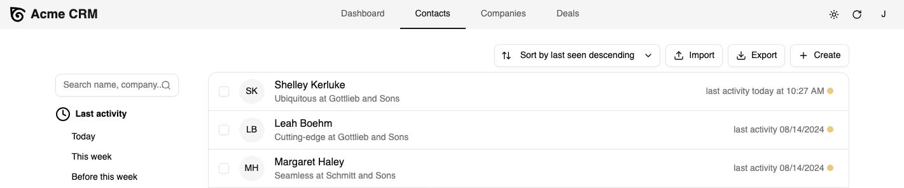
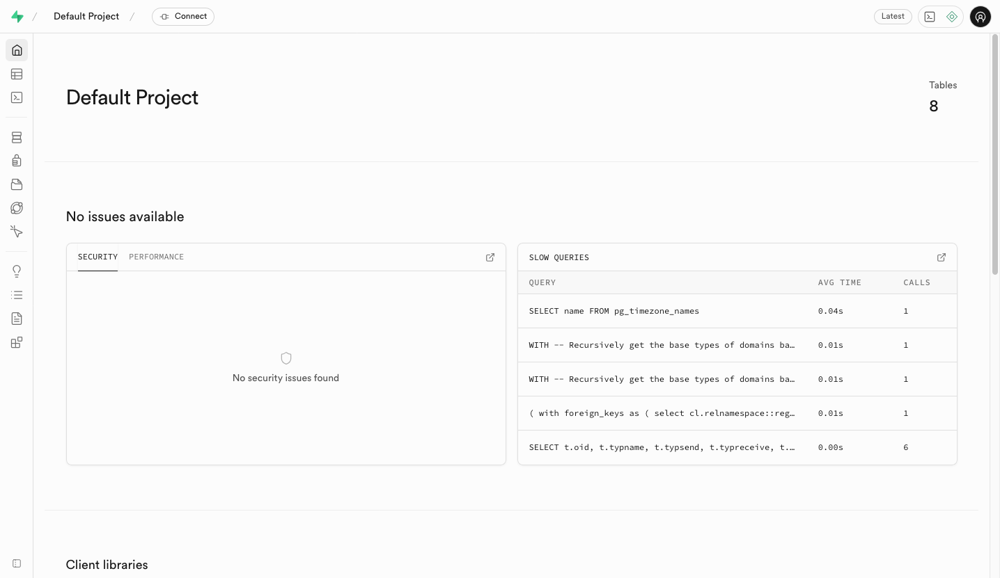
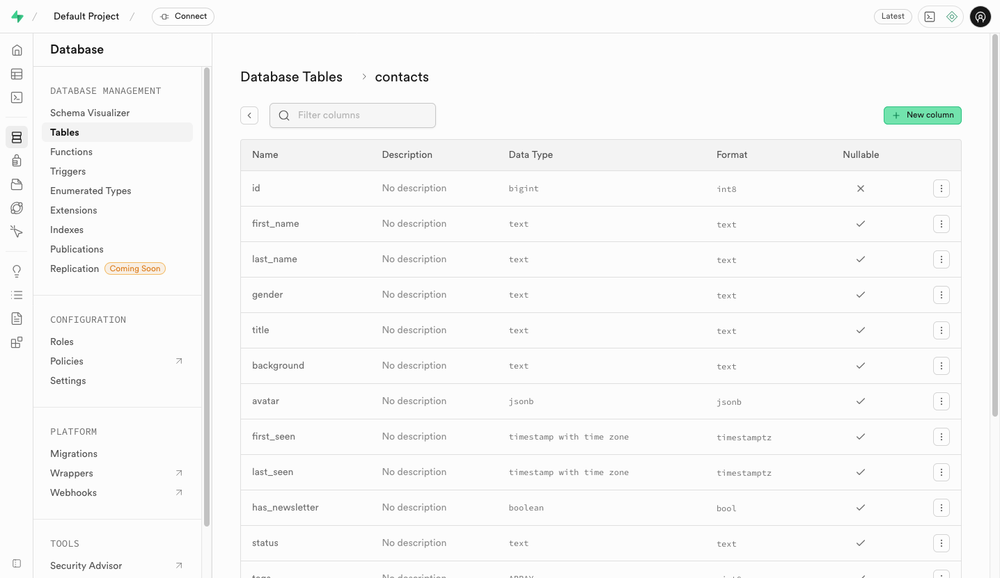
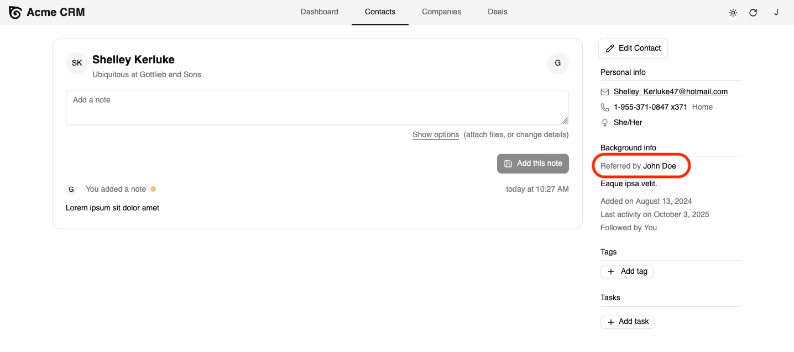

Atomic CRM is designed to be easy to customize and extend by developers with basic React and SQL skills. This guide will help you get started with installing, configuring, and deploying Atomic CRM.

## Prerequisites

- A [GitHub](https://github.com/) account
- [Git](https://git-scm.com/)
- [Node.js](https://nodejs.org/en/download/) (version 20 or higher)
- [Docker](https://docs.docker.com/get-docker/)
- A [Supabase](https://supabase.com/) account for production deployment

## Installation

1. Fork the Atomic CRM repository on GitHub to your own account.

    

2. Clone your forked repository to your local machine:

    ```bash
    git clone https://github.com/[username]/atomic-crm.git
    cd atomic-crm
    ```

3. Install the dependencies:

    ```bash
    npm install
    ```

## Running Locally

1. Start the database and API, powered by Supabase:

    ```bash
    npx supabase start
    ```

2. Start the development server, powered by Vite:

    ```bash
    npm run dev
    ```

Atomic CRM now runs at [http://localhost:5173/](http://localhost:5173/).


:::tip
If you need debug the backend, you can access the following services:

- Supabase dashboard: [http://localhost:54323/](http://localhost:54323/)
- REST API: [http://127.0.0.1:54321](http://127.0.0.1:54321)
- Attachments storage: [http://localhost:54323/project/default/storage/buckets/attachments](http://localhost:54323/project/default/storage/buckets/attachments)
- Inbucket email testing service: [http://localhost:54324/](http://localhost:54324/)
:::

## Admin User Setup

When you first access the application at [http://localhost:5173/](http://localhost:5173/), you will be prompted to create the first admin user. This user will have full access to the application and will be able to manage other users.

<video src="https://github.com/user-attachments/assets/2e5fa809-bd46-4ea1-926f-6f53358de681" controls className="w-full aspect-884/724"></video>

Once the admin user is created, you will be redirected to the dashboard. It's currently showing an onboarding screen to help you get started as long as there is no data in the database.

## Bootstrapping with Sample Data

It's easier to develop on a non-empty application. Atomic CRM provides a sample dataset you can import to get started. Click the import button and choose the sample data file at `test-data/contacts.csv`. This will add 500 contacts and 55 companies to your local database.



Now you can navigate to the Contacts list. Play with the application to get familiar with its features. Add a few notes and tasks to some contacts. This will end the onboarding and reveal the regular dashboard.


:::tip
If you need to reset the database, stop the Supabase instance with `npx supabase stop --no-backup`, and restart it with `npx supabase start`.
:::

## Configuring the Application

The entry point of the application is the `src/App.tsx` file. By default, this file simply renders the `<CRM>` component, which is the root component of Atomic CRM.

```tsx
import { CRM } from "@/components/atomic-crm/root/CRM";

const App = () => <CRM />;

export default App;
```

`<CRM>` accepts various props to customize the application domain and look and feel. For instance, the following code snippet shows how to customize the app title, the task types, and deal categories.

```tsx {5-7}
import { CRM } from "@/components/atomic-crm/root/CRM";

const App = () => (
    <CRM
        title="Acme CRM"
        taskTypes={['Call', 'Email', 'Meeting']}
        dealCategories={['eCommerce', 'SaaS', 'Consulting']}
    />
);

export default App;
```



Check the [Customizing Atomic CRM](./developers/customizing) guide for an exhaustive list of configuration settings you can customize.

## Adding Custom Fields

You can extend the data model of Atomic CRM by adding custom fields to the existing entities (Contacts, Companies, Deals, Notes, and Tasks).

You will do so in the Supabase Studio. To access the Studio, go to [http://localhost:54323/](http://localhost:54323/).



We're going to add a custom field to the Contacts table: a "Referred By" text field to store the name of the person who referred the contact.

1. Click on the Database menu
2. Choose the Tables section in the Database management panel. You will see the list of tables used by Atomic CRM.
3. Click on the `contacts` table in the list of tables.
4. Click on the "New Column" button to add a new column to the table.

    

5. In the "Add new column to contacts" dialog, enter the following details:
    - Name: `referred_by`
    - Type: `text`
    - Default value: leave empty
    - Allow Nullable: checked
6. Finally, click on the "Save" button to add the new column to the table.

    

Atomic CRM uses views to simplify the queries. You need to update the `contacts_summary` view to include the new `referred_by` field.

1. Click on the "SQL Editor" menu in the left sidebar.
2. Enter the following SQL query to update the `contacts_summary` view:

    ```sql
    drop view "public"."contacts_summary";
    create view "public"."contacts_summary"
        with (security_invoker=on)
        as
    select
        co.*,
        c.name as company_name,
        count(distinct t.id) as nb_tasks
    from
        "public"."contacts" co
    left join
        "public"."tasks" t on co.id = t.contact_id
    left join
        "public"."companies" c on co.company_id = c.id
    group by
        co.id, c.name;
    ```

    

3. Click on the "Run" button to execute the SQL command. You will need to confirm the action since it will drop and recreate the view.

4. Create a migration for these schema changes, to allow them to be replicated in production. Run the following command in your terminal:

    ```sh
    npx supabase db diff -f create_referred_by
    ```

    This will create a new migration file in the `supabase/migrations` folder. Supabase will automatically apply this migration when you deploy to production.

That's it! You've just added a custom field to the Contacts entity. Supabase automatically updates the API to include the new field.

## Displaying Custom Fields in the Frontend

Next, you need to make this new field available in the frontend.

The frontend code lives in the `src/components/atomic-crm` folder, and is organized by entities. Each entity has its own folder containing all the components related to that entity. Take a few minutes to explore the codebase and familiarize yourself with its structure.

:::tip
Atomic CRM leverages two libraries that provided high-level building blocks: [Shadcn Admin Kit](https://marmelab.com/shadcn-admin-kit/) for the application logic, and [Shadcn/ui](https://ui.shadcn.com/) for the UI components. The code for these libraries is copied in the `src/components` folder.
:::

Atomic CRM uses TypeScript to ensure type safety, so you'll need to modify the `Contact` type to include the new `referred_by` field. Open the `src/components/atomic-crm/types.ts` file and add the `referred_by` field to the `Contact` interface.

```tsx {18}
export type Contact = {
  first_name: string;
  last_name: string;
  title: string;
  company_id: Identifier;
  email_jsonb: EmailAndType[];
  avatar?: Partial<RAFile>;
  linkedin_url?: string | null;
  first_seen: string;
  last_seen: string;
  has_newsletter: boolean;
  tags: Identifier[];
  gender: string;
  sales_id: Identifier;
  status: string;
  background: string;
  phone_jsonb: PhoneNumberAndType[];
  referred_by?: string;
  nb_tasks?: number;
  company_name?: string;
} & Pick<RaRecord, "id">;
```

You will modify the contact creation and edition form to include an input for the `referred_by` field.
To do so, open the `src/components/atomic-crm/contacts/ContactInputs.tsx` file to edit the `<ContactInputs>` component and add a new `<TextInput>`.

```tsx {5-8}
const ContactMiscInputs = () => {
  return (
    <div className="flex flex-col gap-4">
      <h6 className="text-lg font-semibold">Misc</h6>
      <TextInput
        source="referred_by"
        helperText={false}
      />
      <TextInput
        source="background"
        label="Background info (bio, how you met, etc)"
        multiline
        helperText={false}
      />
      <BooleanInput source="has_newsletter" helperText={false} />
      <ReferenceInput
        reference="sales"
        source="sales_id"
        sort={{ field: "last_name", order: "ASC" }}
        filter={{
          "disabled@neq": true,
        }}
      >
        <SelectInput
          helperText={false}
          label="Account manager"
          optionText={saleOptionRenderer}
          validate={required()}
        />
      </ReferenceInput>
    </div>
  );
};
```

`<TextInput>` is a Shadcn Admin Kit component that binds a form field to the form state. Upon submission, the form data will include the `referred_by` field and the Supabase API will store it in the database.

The application will automatically pick up this code change. Go back to [http://localhost:5173/](http://localhost:5173/) and you can now create or edit a contact and set the "Referred By" field.


Finally, update the Contacts sidebar to display the referrer when available. Open the `src/components/atomic-crm/contacts/ContactAside.tsx` file and add a new `<TextField>` for the `referred_by` field.

```tsx {4-11}
export const ContactAside = ({ link = "edit" }: { link?: "edit" | "show" }) => {
    // ...
      <AsideSection title="Background info">
        {record.referred_by && (
          <div className="pb-2">
            <span className="text-sm text-muted-foreground mr-1">
              Referred by
            </span>
            <TextField source="referred_by" />
          </div>
        )}
        <WithRecord<Contact>
          render={(record) =>
            record?.background ? (
              <TextField source="background" record={record} className="pb-2" />
            ) : null
          }
        />
        // ...
};
```

This will display the "Referred By" information in the contact sidebar when available.



## Deploying to Production

It's time to deploy your customized version of Atomic CRM to production. You use [Supabase.com](https://supabase.com) to host the backend, and GitHub Pages to host the frontend. Both services offer free plans that are sufficient for Atomic CRM.

First, login or register to [Supabase.com](https://supabase.com).

Atomic CRM comes with a CLI utility to create a backend instance on Supabase.com:

```sh
make supabase-remote-init
```

The script will ask you for the Supabase instance name, create the database, apply the migrations and deploy the edge functions. Finally, it will create a `.env.production.local` file with your remote Supabase configuration.

The frontend of the CRM is a Single-Page App that can be deployed to any CDN. Since you have forked the Atomic CRM repository on GitHub, you can use GitHub Pages to host the frontend.

First, build the frontend bundle with:

```sh
npm run build
```

This will create a `dist` directory with the built application made of static HTML, CSS, and JS files.

To deploy it to GitHub pages, use the following command:

```sh
npm run ghpages:deploy
```

After a couple minutes, your customized CRM will be available at `https://<username>.github.io/atomic-crm/`, and connected to the production Supabase instance you created earlier.

You can proceed with the creation of the first admin user and start using your CRM in production!


:::tip
Supabase.com and GitHub Pages are just two of the many services you can use to host your Atomic CRM. You can [self-host a supabase instace](https://supabase.com/docs/guides/self-hosting), and use any static server or CDN (e.g. CloudFlare, Netlify, Vercel, etc.) to host the frontend.
:::

## Next Steps

Explore the documentation to learn more about Atomic CRM:

### User Documentation

1. [User Management](./users/user-management)
2. [Importing And Exporting Data](./users/import-contacts)
3. [Inbound Email](./users/inbound-email)

### Developer Documentation

- [General Concepts](./developers/architecture-choices)
- [Using Fake Rest Data Provider for Development](./developers/data-providers)

- Customization

  - [Changing The Constants](./developers/customizing)
  - [Updating The Model](./developers/migrations)

- Deploying to Production
  - [Configuring Supabase](./developers/supabase-configuration)
  - [Configuring Inbound Email](./developers/inbound-email-configuration) *(optional)*
  - [Deployment](./developers/deploy)
