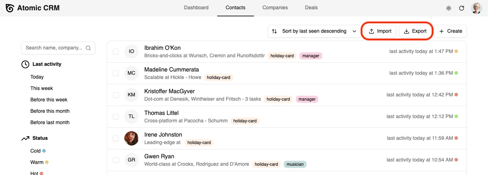
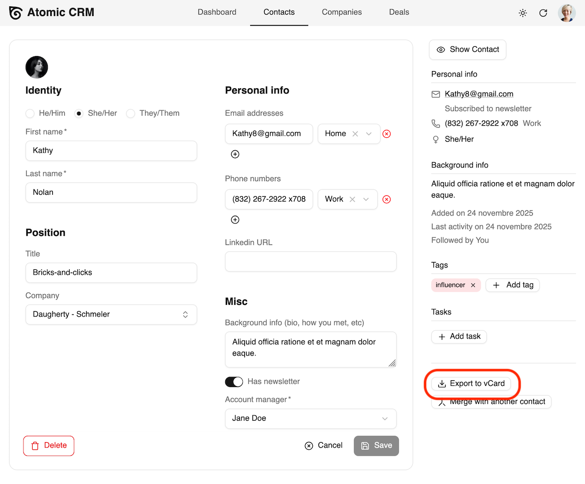

You can import and export contacts and companies from and to a CSV file, e.g. to migrate from another CRM.

## Importing Data

Atomic CRM displays an import contact buttons in the initial user onboarding page, and in the contacts page. When clicking on it, a modal is displayed to upload a CSV file.

<video src="https://github.com/user-attachments/assets/a1133cf0-0287-4fc0-b61b-5a0b88617cfc" controls className="w-full aspect-1304/814"></video>

An example of the expected CSV file is available in the contact import modal:

```csv
first_name,last_name,gender,title,background,first_seen,last_seen,has_newsletter,status,tags,linkedin_url,company,email_work,email_home,email_other,phone_work,phone_home,phone_other
John,Doe,male,Sales Executive,,2024-07-01T00:00:00+00:00,2024-07-01T11:54:49.95+00:00,false,in-contract,"influencer, developer",https://www.linkedin.com/in/johndoe,Acme,john@doe.example,john.doe@gmail.com,jdoe@caramail.com,659-980-2015,740.645.3807,(446) 758-2122
Jane,Doe,female,Designer,,2024-07-01T00:00:00+00:00,2024-07-01T11:54:49.95+00:00,false,in-contract,"UI, design",https://www.linkedin.com/in/janedoe,Acme,,,jane@doe.example,659-980-2020,740.647.3802,
```

When importing contacts, companies and tags will be automatically matched if they exist on the system, or imported otherwise.

## Exporting Data

In the contacts and companies pages, an export button allows to download the list of contacts or companies in CSV format.



You can also export a single contact as a vCard file from the aside panel in the Contact Edit page.

