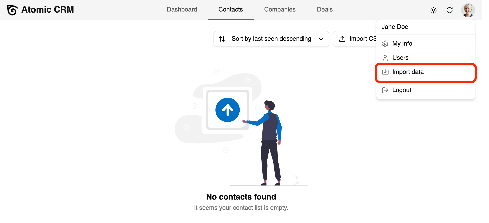
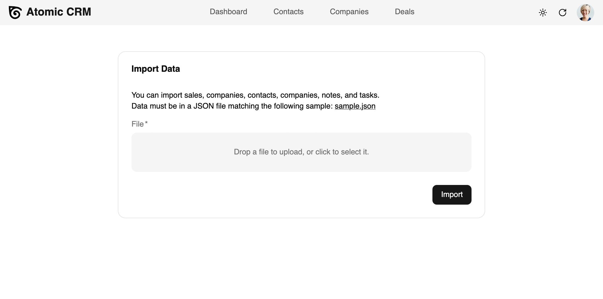
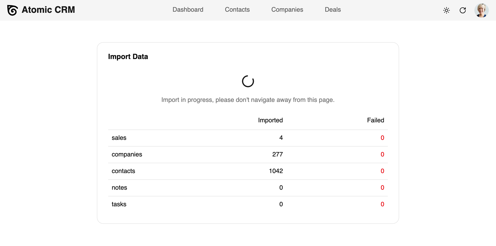

Whether you are starting to use Atomic CRM, or want to migrate from another CRM, you can import your contacts, companies, tasks, notes, tags and deals in a few clicks. You can also export your contacts and companies in CSV format, and your contacts as vCard files.

## Import Contacts From CSV

Atomic CRM displays an import contact buttons in the initial user onboarding page, and in the contacts page. When clicking on it, a modal is displayed to upload a CSV file.

<video src="https://github.com/user-attachments/assets/a1133cf0-0287-4fc0-b61b-5a0b88617cfc" controls className="w-full aspect-1304/814"></video>

An example of the expected CSV file is available in the contact import modal:

```csv
first_name,last_name,gender,title,background,first_seen,last_seen,has_newsletter,status,tags,linkedin_url,company,email_work,email_home,email_other,phone_work,phone_home,phone_other
John,Doe,male,Sales Executive,,2024-07-01T00:00:00+00:00,2024-07-01T11:54:49.95+00:00,false,in-contract,"influencer, developer",https://www.linkedin.com/in/johndoe,Acme,john@doe.example,john.doe@gmail.com,jdoe@caramail.com,659-980-2015,740.645.3807,(446) 758-2122
Jane,Doe,female,Designer,,2024-07-01T00:00:00+00:00,2024-07-01T11:54:49.95+00:00,false,in-contract,"UI, design",https://www.linkedin.com/in/janedoe,Acme,,,jane@doe.example,659-980-2020,740.647.3802,
```

When importing contacts, companies and tags will be automatically matched if they exist on the system, or imported otherwise.

## Export Contacts To CSV

In the contacts and companies pages, an export button allows to download the list of contacts or companies in CSV format.


## Export Contacts To vCard

You can also export a single contact as a vCard file from the aside panel in the Contact Edit page.


## Migrating From Another CRM

Atomic CRM allows to import contacts, companies, tasks, notes, tags and deals from a single JSON file. You can create this JSON file from the export of your previous CRM. The expected format of the JSON file looks like the following:

```json
{
  "sales": [
    { "id": 123, "first_name": "John", "last_name": "Doe", "email": "john@acme.com" }
  ],
  "companies": [
    { "id": 234, "name": "A company" },
    { "id": 345, "name": "Another company", "description": "A description", "city": "A city", "country": "A country", "address": "An address", "zipcode": "A zipcode", "state_abbr": "A state abbreviation", "sales_id": 123 }
  ],
  "contacts": [
    { "id": 456, "first_name": "Jane", "last_name": "Smith" },
    { "id": 567, "first_name": "A first name", "last_name": "A last name", "title": "A title", "company_id": 345, "background": "A background", "linkedin_url": "A URL", "sales_id": 123, "emails": [ { "email": "nickname@domain.com", "type": "Work" } ], "phones": { "number": "45646746788", "type": "Home" }, "tags": ["MyTag"] }
  ],
  "notes": [
    { "contact_id": 456, "sales_id": 123, "text": "Some text", "date": "2025-11-13T08:16:10Z" },
    { "contact_id": 456, "sales_id": 123, "text": "Some long text with lines\n\nAnother line", "date": "2025-02-14T09:20:21Z", "attachments": [ { "url": "https://mycurrentcrm.com/files/link", "name": "important.pdf" } ] }
  ],
  "tasks": [
    { "contact_id": 456, "sales_id": 123, "text": "A task title" },
    { "contact_id": 456, "sales_id": 123, "text": "Another task title", "due_date": "2025-03-26T16:15:00Z", "done_date": "2025-04-01T09:00:00" }
  ],
}

```

To display the import page, click on the User menu in the top right corner, and click on "Import data".



A form displays to upload a JSON file. You can download a sample JSON file to see the expected format.



Once you launch the import, the page will show the progress of the import, and display any error if the import fails.



This migration tool will allow you to easily migrate from your previous CRM to Atomic CRM, and start using it in a few clicks.