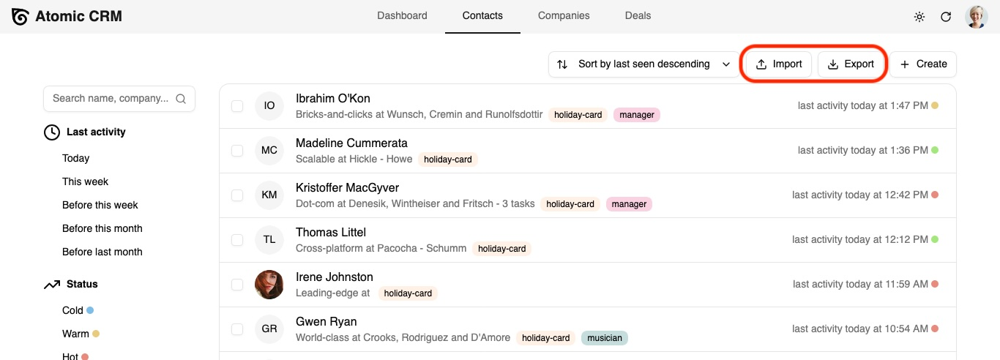
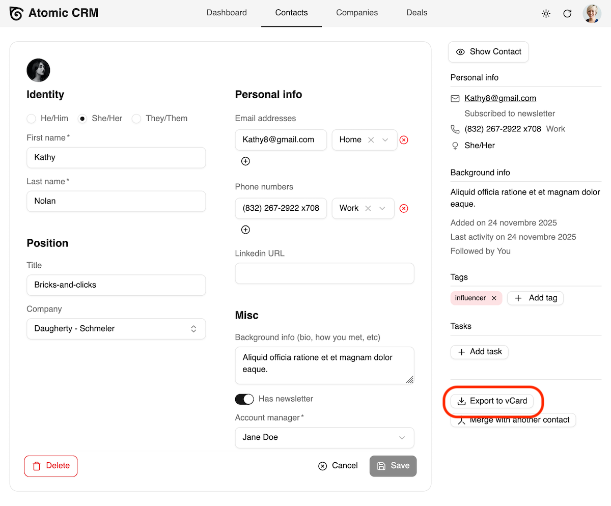
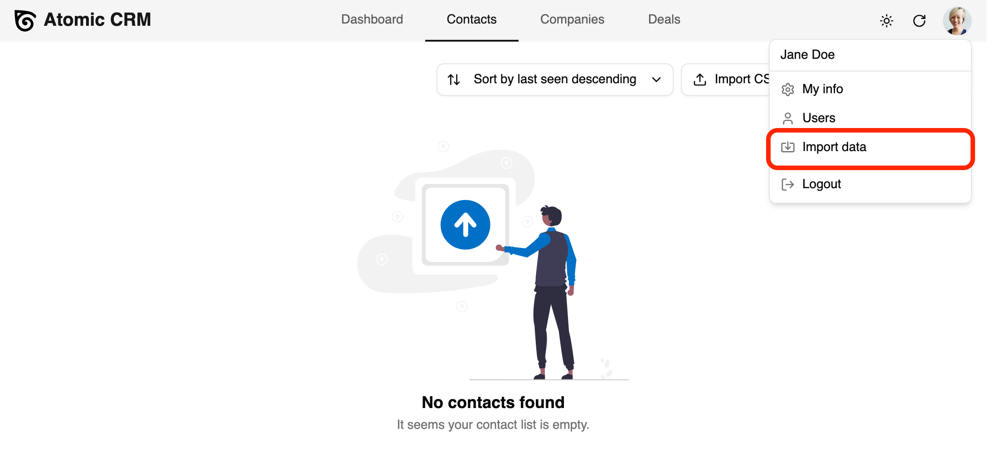
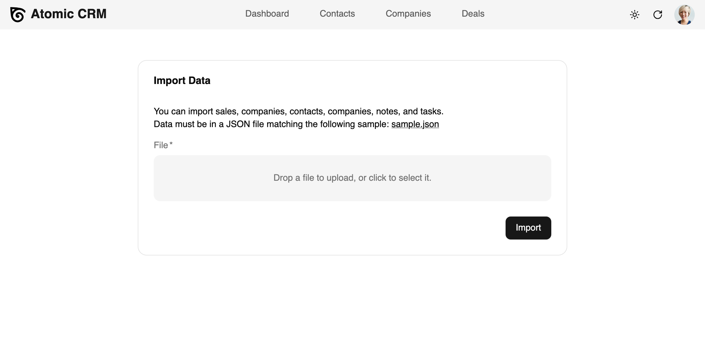
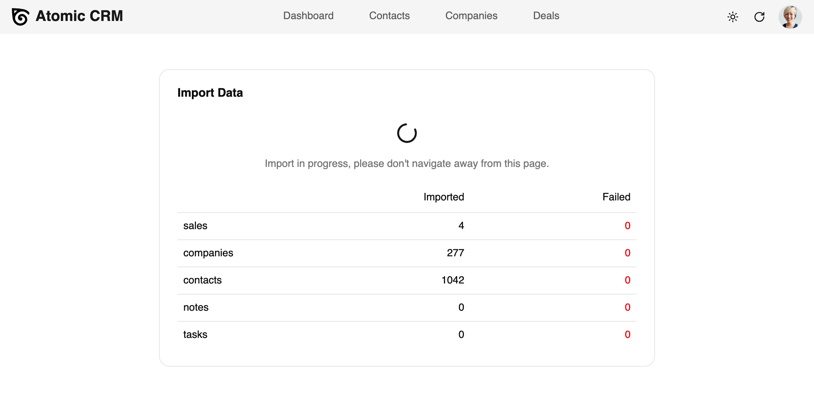

Whether you are starting to use Atomic CRM, or want to migrate from another CRM, you can import your contacts, companies, tasks, notes, tags and deals in a few clicks. You can also export your contacts and companies in CSV format, and your contacts as vCard files.

## Import Data From CSV

Atomic CRM imports contacts, companies and deals from CSV files. Two buttons open the same import dialog:

- **Import data**, on the initial user onboarding page, lets you choose the resource to import into.
- **Import CSV**, on the contacts, companies and deals pages, imports into that resource directly.

<video src="https://github.com/user-attachments/assets/a1133cf0-0287-4fc0-b61b-5a0b88617cfc" controls className="w-full aspect-1304/814"></video>

For each resource, the dialog offers a sample CSV file to download, showing the expected columns. Columns the CRM does not know are ignored, and columns you omit are left empty.

### Contacts

```csv
first_name,last_name,gender,title,background,first_seen,last_seen,has_newsletter,status,tags,linkedin_url,company,email_work,email_home,email_other,phone_work,phone_home,phone_other
John,Doe,male,Sales Executive,,2024-07-01T00:00:00+00:00,2024-07-01T11:54:49.95+00:00,false,in-contract,"influencer, developer",https://www.linkedin.com/in/johndoe,Acme,john@doe.example,john.doe@gmail.com,jdoe@caramail.com,659-980-2015,740.645.3807,(446) 758-2122
Jane,Doe,female,Designer,,2024-07-01T00:00:00+00:00,2024-07-01T11:54:49.95+00:00,false,in-contract,"UI, design",https://www.linkedin.com/in/janedoe,Acme,,,jane@doe.example,659-980-2020,740.647.3802,
```

When importing contacts, companies and tags will be automatically matched if they exist on the system, or imported otherwise.

### Companies

```csv
name,sector,size,linkedin_url,website,phone_number,address,zipcode,city,state_abbr,country,description,revenue,tax_identifier
Acme,Information Technology,50,https://www.linkedin.com/company/acme,https://acme.example,555-0100,1 Main Street,10001,New York,NY,USA,Long-time partner on print projects,5M,US-123456789
Globex,Industrials,250,,https://globex.example,555-0111,42 Industrial Road,60601,Chicago,IL,USA,,20M,
```

The `name` column is required. `sector` is matched against the company sectors configured in your CRM, either by stored value or by the label displayed in the app; a sector matching none of them is left empty.

### Deals

```csv
name,company,category,stage,amount,expected_closing_date,description
New website,Acme,Website design,Opportunity,12000,2026-09-30,Redesign of the public website
Print campaign,Globex,Print project,Proposal Sent,4500,2026-10-15,
```

The `name` column is required. The `company` column holds a company name: an existing company is reused, an unknown one is created. `category` and `stage` are matched against the deal categories and stages configured in your CRM, by stored value or displayed label. Since a deal always belongs to a stage, an empty or unrecognized `stage` falls back to the first stage of your pipeline.

## Export Contacts To CSV

In the contacts and companies pages, an export button allows to download the list of contacts or companies in CSV format.



## Export Contacts To vCard

You can also export a single contact as a vCard file from the aside panel in the Contact Edit page.



## Migrating From Another CRM

Atomic CRM allows to import contacts, companies, tasks, notes, tags and deals from a single JSON file. You can create this JSON file from the export of your previous CRM. The expected format of the JSON file looks like the following:

```json
{
  "sales": [
    {
      "id": 123,
      "first_name": "Barney",
      "last_name": "Calhoun",
      "email": "barney.calhoun@blackmesa.com"
    }
  ],
  "companies": [
    {
      "id": 234,
      "name": "Black Mesa Research Facility",
      "sector": "industrials",
      "size": 250,
      "website": "https://blackmesa.com",
      "linkedin_url": "https://linkedin.com/company/black-mesa",
      "phone_number": "+1-505-555-0001",
      "revenue": "$500M",
      "tax_identifier": "12-3456789"
    },
    {
      "id": 345,
      "name": "Aperture Science",
      "description": "We do what we must because we can",
      "city": "Cleveland",
      "country": "USA",
      "address": "Deep underground facility",
      "zipcode": "99999",
      "state_abbr": "OH",
      "sector": "industrials",
      "size": 500,
      "linkedin_url": "https://linkedin.com/company/aperture-science",
      "website": "https://aperturescience.com",
      "phone_number": "+1-216-555-0100",
      "revenue": "$2B",
      "tax_identifier": "98-7654321",
      "context_links": [
        "https://aperturescience.com/research",
        "https://aperturescience.com/portal-technology"
      ],
      "sales_id": 123
    }
  ],
  "contacts": [
    {
      "id": 456,
      "first_name": "Gordon",
      "last_name": "Freeman",
      "gender": "male",
      "has_newsletter": false
    },
    {
      "id": 567,
      "first_name": "Cave",
      "last_name": "Johnson",
      "title": "CEO & Founder",
      "company_id": 345,
      "background": "Visionary entrepreneur. Believes in the power of science. May or may not have turned himself into a computer.",
      "linkedin_url": "https://linkedin.com/in/cavejohnson",
      "gender": "male",
      "has_newsletter": true,
      "sales_id": 123,
      "emails": [
        {
          "email": "cave.johnson@aperturescience.com",
          "type": "Work"
        }
      ],
      "phones": [
        {
          "number": "15551234567",
          "type": "Work"
        }
      ],
      "tags": ["VIP", "Science"]
    }
  ],
  "notes": [
    {
      "contact_id": 456,
      "sales_id": 123,
      "text": "Still refuses to speak. Communication continues to be challenging.",
      "date": "2025-11-13T08:16:10Z"
    },
    {
      "contact_id": 567,
      "sales_id": 123,
      "text": "Discussed new testing initiative involving portals.\n\nCave mentioned something about combustible lemons. Need to follow up on R&D budget.",
      "date": "2025-02-14T09:20:21Z",
      "attachments": [
        {
          "url": "https://aperturescience.com/files/combustible-lemons-proposal.pdf",
          "name": "combustible-lemons-proposal.pdf"
        }
      ]
    }
  ],
  "tasks": [
    {
      "contact_id": 456,
      "sales_id": 123,
      "text": "Send crowbar maintenance kit"
    },
    {
      "contact_id": 567,
      "sales_id": 123,
      "text": "Schedule moon rock conversion demo",
      "due_date": "2025-03-26T16:15:00Z",
      "done_date": "2025-04-01T09:00:00"
    }
  ]
}
```

To display the import page, click on the User menu in the top right corner, and click on "Import from JSON".



A form displays to upload a JSON file. You can download a sample JSON file to see the expected format.



Once you launch the import, the page will show the progress of the import, and display any error if the import fails.



This migration tool will allow you to easily migrate from your previous CRM to Atomic CRM, and start using it in a few clicks.