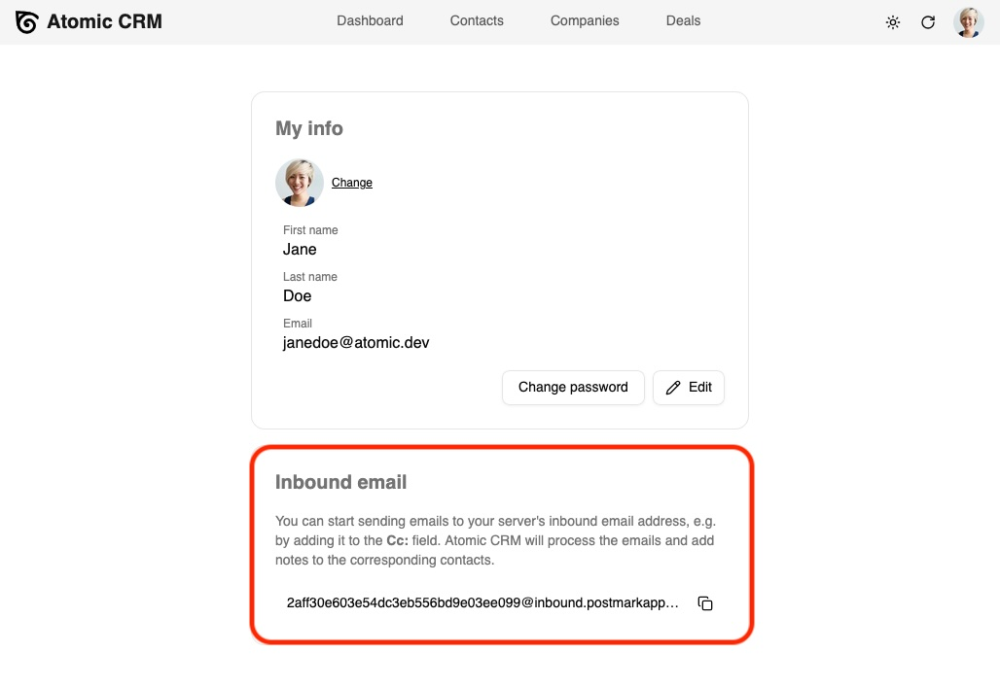

Atomic CRM can receive inbound emails and automatically create or update contacts based on the email content. This feature is useful to keep your CRM up-to-date with the latest interactions with your contacts.

## Setup

You must setup Postmark and Supabase to use the inbound email feature. Check the [Inbound Email Setup](../../developers/inbound-email-configuration) documentation for more information.

## Usage

Send of forward emails to Atomic CRM's inbound email address to automatically add notes to the corresponding contacts. You can find this email address in the user menu by clicking on the "My Info" menu item, in the "Inbound Email" section. It looks like `xxxxxxx@inbound.postmarkapp.com`.



When you write to a contact in your email client, add the inbound email address in the **Bcc** field. PPostmark will receive a copy of your email, and forward it to Atomic CRM. Atomic CRM uses the sender's email address to identify the user, and the recipient's email address to identify the contact. If the contact does not yet exist, Atomic CRM creates it using the email's domain as company name. The content of the email is added as a note to the contact.

**Tip**: Use the **Bcc** field to send emails to Atomic CRM without notifying the recipients.

## Example

Consider the following email:

```txt
From: Jane Doe <jane.doe@marmelab.com>
To: Kim Hegmann <kim.gegmann@acme.com>
Cc: xxxxxxx@inbound.postmarkapp.com
Subject: Meeting with Kim Hegmann

Hi Kim,
I would like to schedule a meeting with you next week. Please let me know your availability.
```

When receiving this email, Atomic CRM will:

- Create the _Acme_ company if it does not exist
- Create the _Kim Hegmann_ contact if it does not exist
- Associate both to _Jane Doe_
- Add a note to the _Kim Hegmann_ contact with the following content:

```txt
Meeting with Kim Hegmann

Hi Kim,
I would like to schedule a meeting with you next week. Please let me know your availability.
```
