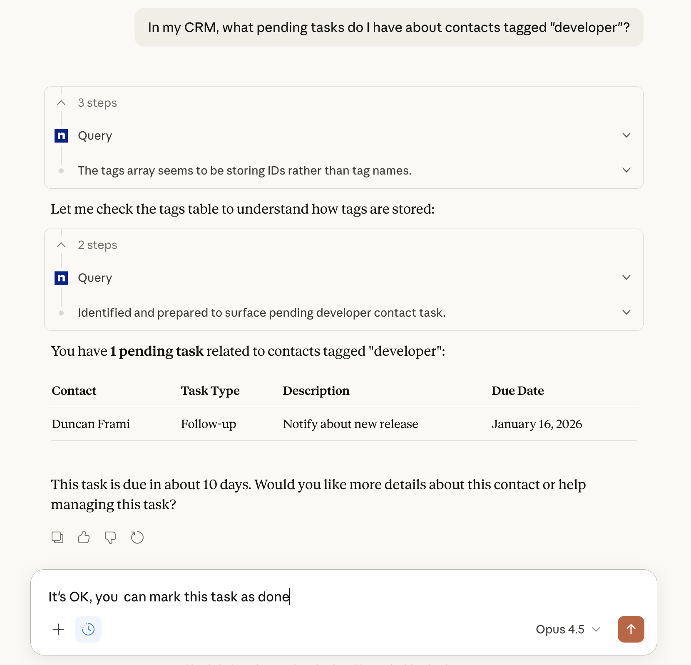

You can interact with the data stored in your Atomic CRM instance using an AI assistant like Claude Desktop or Visual Studio Code, thanks to the MCP Server.

## Installation

The MCP server is a third-party application that you need to install and run on your own infrastructure. You can find the installation instructions in the Atomic CRM MCP Server GitHub repository at https://github.com/marmelab/atomic-crm-mcp.

## Adding Atomic CRM as a MCP Server

The MCP server is currently available for the following AI assistants:

- Visual Studio Code
- Claude Desktop
- Claude Code
- ~~Claude Mobile~~
- ~~ChatGPT Desktop~~
- ~~ChatGPT Mobile~~

Refer to the [MCP Server documentation](https://github.com/marmelab/atomic-crm-mcp#adding-the-mcp-server-to-visual-studio-code) for detailed instructions concerning each AI assistant.

## Usage

Once the MCP server is enabled and authenticated, you can start asking questions about your Atomic CRM data directly from your AI assistant. For example, you can ask:

- "Can you remind me of the pending tasks for the hot contacts?"
- "List all open deals with a value greater than $10,000."
- "What are the top 5 companies by revenue?"

The MCP server will process your queries and return the relevant data from your Atomic CRM instance.

You can also perform actions such as creating new contacts, updating deal statuses, or generating reports using natural language commands.

- "Create a new contact for john.doe@acme.com"
- "The deal #1234 has been won. Update its status."
- "Add a follow-up task about Jeremiah: I should call him next week."