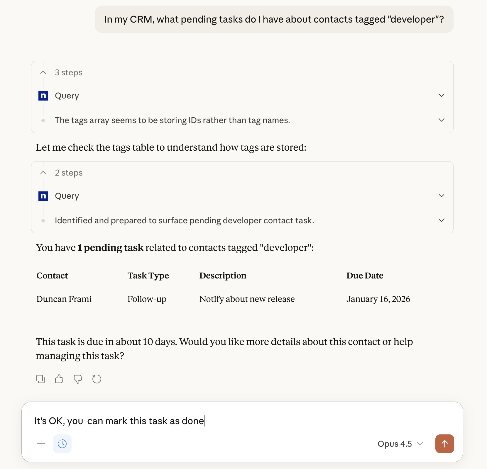
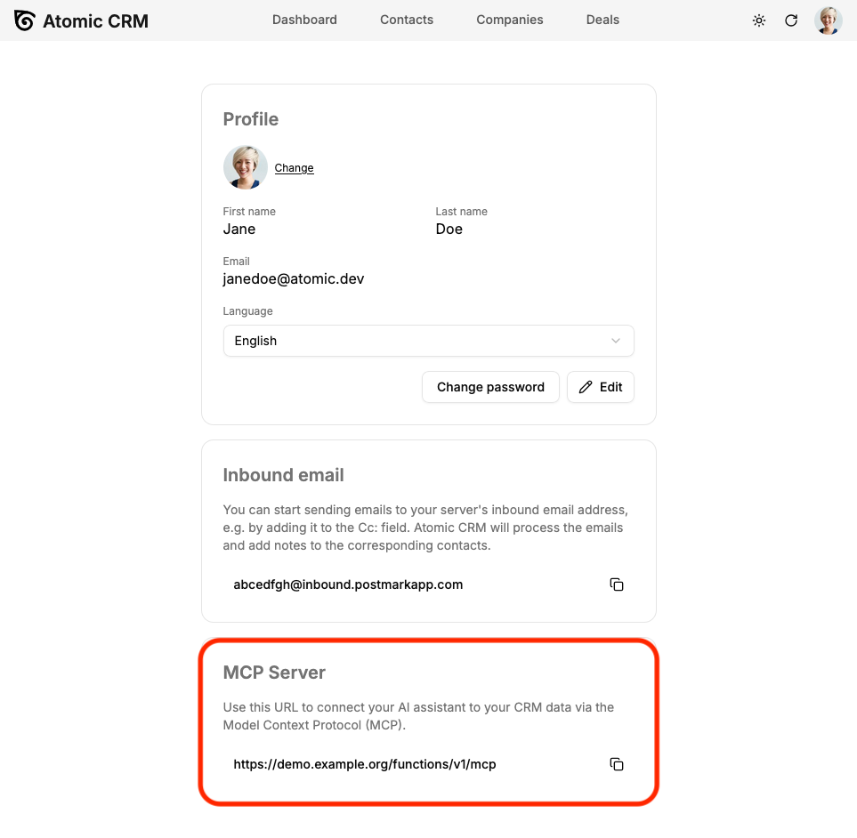

You can interact with the data stored in your Atomic CRM instance using an AI assistant like Claude Desktop or Visual Studio Code, thanks to the MCP Server.



The Atomic CRM MCP server is powered by Supabase Edge Functions and Supabase OAuth, and requires no installation. 

## Getting The MCP Server URL

To get the MCP Server URL, follow these steps:

1. Log in to your Atomic CRM instance.
2. Click on your profile picture in the top right corner to open the user menu.
3. Select "Profile" from the dropdown menu.
4. In the "Profile" page, scroll down to the "MCP Server" section.
5. Here, you will find the MCP Server URL that you can copy and use to connect your AI assistant.



## Adding The Atomic CRM MCP Server to Your AI Assistant

The MCP server is currently available for the following AI assistants:

- Chat GPT
- Claude.ai
- Visual Studio Code
- Claude Desktop
- Claude Code
- ~~Gemini~~
- ~~Claude Mobile~~
- ~~ChatGPT Desktop~~
- ~~ChatGPT Mobile~~

### Adding the MCP server to Chat GPT

Note: Atomic CRM MCP works both on the web and mobile versions of ChatGPT. You need a paid Chat GPT account to use custom connectors.

1. Enable the [Developer Mode](https://platform.openai.com/docs/guides/developer-mode) in [Settings → Apps → Advanced](https://chatgpt.com/apps#settings/Connectors/Advanced) settings
2. Then, under [Settings → Apps](https://chatgpt.com/apps#settings/Connectors), click on the Create button
3. Fill in the fields as follows:
    - Name: Atomic CRM
    - MCP Server URL: your MCP Server URL (see "Getting The MCP Server URL" section above)
    - Authentication: OAuth
    - Check the "I understand and want to continue" checkbox
4. Click "Create"
5. A browser window opens for you to authenticate to Atomic CRM and allow access to Claude Code.
6. Once authenticated, you can start using the Atomic CRM extension in Chat GPT

If you're on a workspace or organization account, you need to ask your admin to add and approve the custom connector before you can use it.

### Adding the MCP server to Claude.ai

Note: Atomic CRM MCP works both on the web and mobile versions of Claude.You need a paid Claude.ai account to use custom connectors.

1. Open Claude.ai and open the [Settings → Connectors](https://claude.ai/settings/connectors) page
2. Then click on "Add custom connector"
3. Fill in the fields as follows:
    - Name: Atomic CRM
    - MCP Server URL: your MCP Server URL (see "Getting The MCP Server URL" section above)
4. Click "Add"
5. A browser window opens for you to authenticate to Atomic CRM and allow access to Claude Code.
6. Once authenticated, you can start using the Atomic CRM extension in Chat GPT

### Adding the MCP server to Visual Studio Code

1. Open the command palette (Ctrl+Shift+P or Cmd+Shift+P) and run the "MCP: Add Server..." command.
2. In the dropdown listing MCP types, choose "HTTP"
3. Enter the MCP server URL (see "Getting The MCP Server URL" section above) when prompted.
4. Name this server `atomic-crm` when prompted.
5. Choose "Global" or "Local" scope as desired.
6. A Dialog opens for you to authenticate to Atomic CRM and allow access. Click "Allow".
7. A browser window opens for you to authenticate to Atomic CRM and allow access to Claude Code.
8. Once authenticated, you can start using the Atomic CRM extension in Visual Studio Code

### Adding The MCP Server To Claude Desktop

1. Navigate to Settings > Extensions on Claude Desktop.
2. Click on "Add a custom Extension".
3. Fill in the fields as follows:
    - Name: Atomic CRM
    - URL: your MCP Server URL (see "Getting The MCP Server URL" section above)
4. Click "Add".
5. The new extension should now appear in your list of extensions. Click on "Connect" to start using it.
6. A browser window opens for you to authenticate to Atomic CRM and allow access to Claude.
7. Once authenticated, you can start using the Atomic CRM extension in Claude.

### Adding the MCP server to Claude Code

1. Add the Atomic CRM MCP server to Claude Code by running the following command in your terminal:
    ```bash
    claude mcp add atomic-crm --transport http {MCP Server URL}
    ```

2. Open Claude Code 
    ```bash
    claude
    ```

3. List the available MCP servers
    ```bash
    /mcp
    ```

4. The `atomic-crm` server should appear as "needs authentication". Press Enter to authenticate.
5. A browser window opens for you to authenticate to Atomic CRM and allow access to Claude Code.
6. Once authenticated, you can start using the Atomic CRM extension in Claude Code.

## Usage

Once the MCP server is enabled and authenticated, you can start asking questions about your Atomic CRM data directly from your AI assistant. For example, you can ask:

- "Can you remind me of the pending tasks for the hot contacts?"
- "List all open deals with a value greater than $10,000."
- "What are the top 5 companies by revenue?"

The MCP server will process your queries and return the relevant data from your Atomic CRM instance.

You can also perform actions such as creating new contacts, updating deal statuses, or generating reports using natural language commands.

- "Create a new contact for john.doe@acme.com"
- "The deal #1234 has been won. Update its status."
- "Add a follow-up task about Jeremiah: I should call him next week."

Finally, if you have other connectors set up, you can ask the AI assistant to combine data from Atomic CRM with data from other sources. For example:

- "Find the contacts I met last week and write a draft email to each of them summarizing our last conversation and suggesting next steps."
- "Book a meeting for the Acme deal, include the deal notes in the description, and invite the contact person from that deal."
