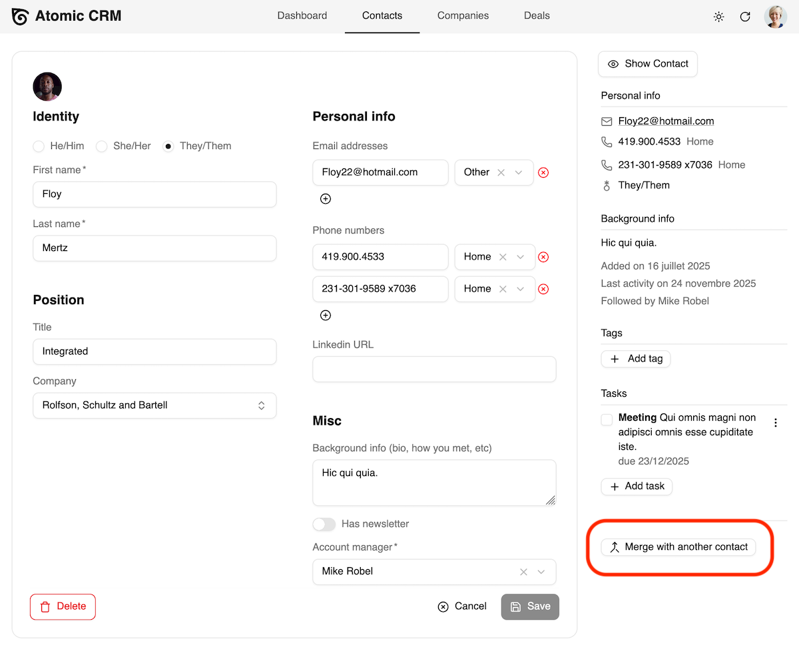
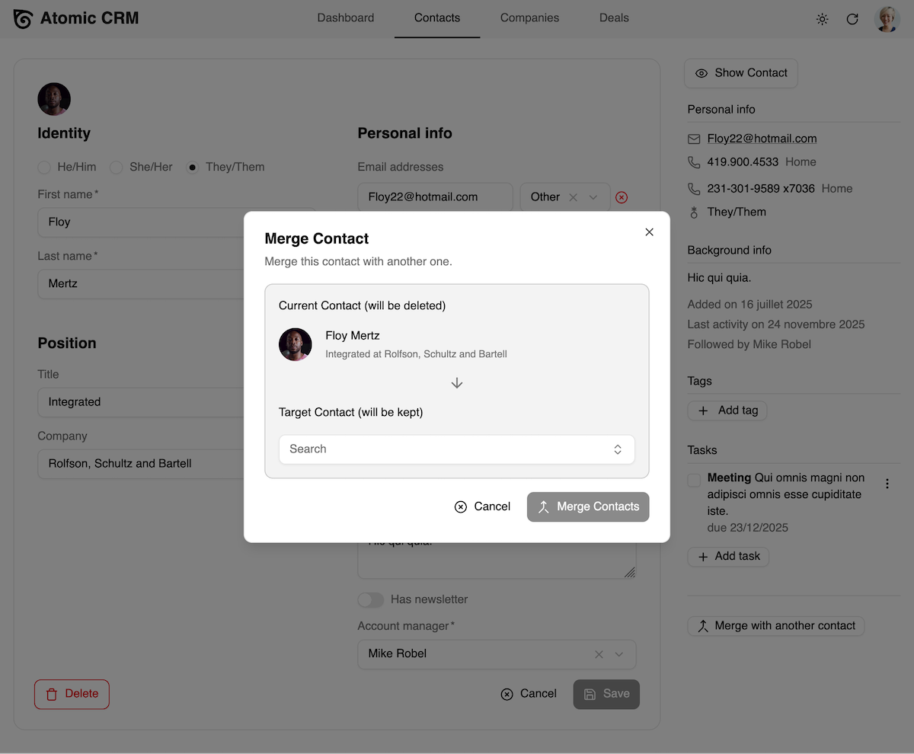
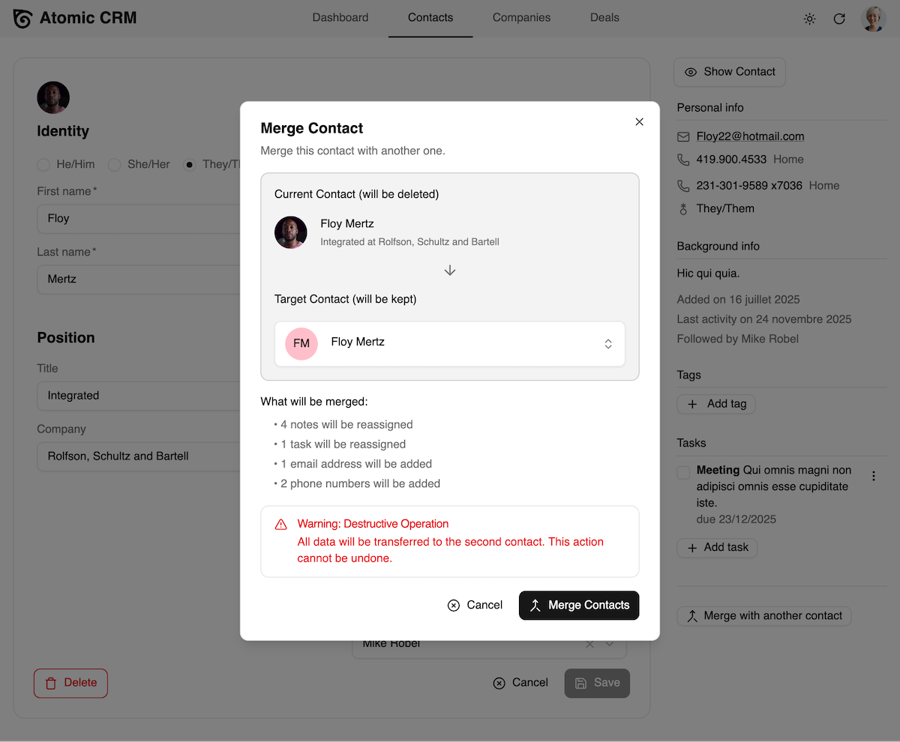
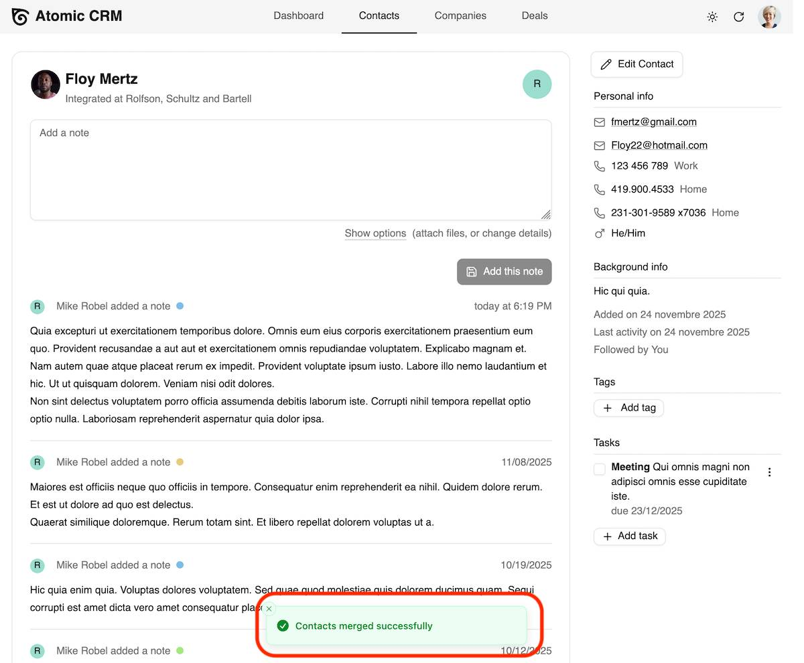

Atomic CRM allows you to merge duplicate contacts into a single contact to maintain a clean and organized database.

## Selecting the Two Contacts to Merge

In the Contacts page, select the contact you want to merge into another, then edit it. 

In the Contact Edit page, click on the "Merge with another contact" button on the side panel.

A dialog will appear allowing you to search for the contact you want to merge with.

## Reviewing and Confirming the Merge

Atomic CRM will merge the selected contact into the target contact. This means that all information from the selected contact will be transferred to the target contact, and the selected contact will be deleted.

When both the current contact and the target contact have a given property (like position or company), Atomic CRM keeps the one of the target contact.

Click the "Merge Contacts" button to complete the process. The current contact will be merged into the target contact, and all associated data will be consolidated.

## Causes of Duplicate Contacts

It is common to have duplicate contacts in your CRM. Duplicate contacts can arise from various situations, such as:

- Importing contacts from several CSV files that contain overlapping data.
- Receiving an inbound email creates a new contact for a new email address instead of associating with an existing contact.
- Manually adding contacts without checking for existing entries.