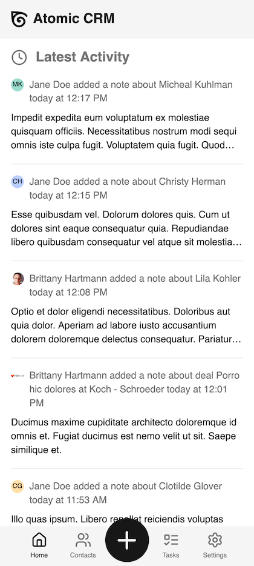
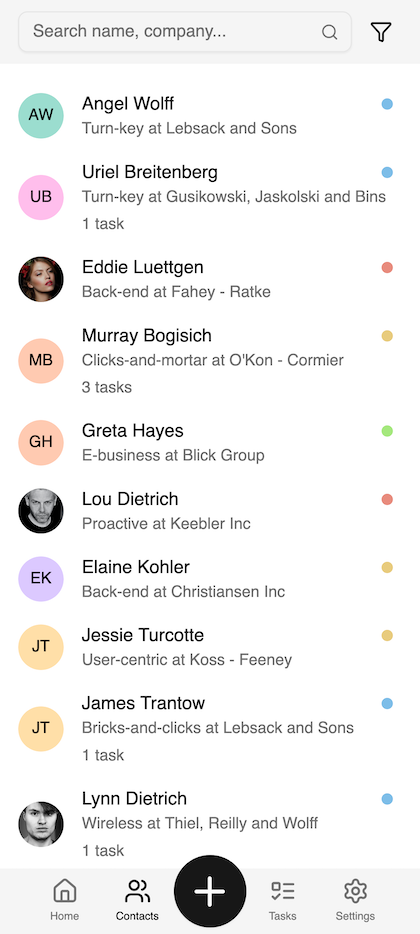
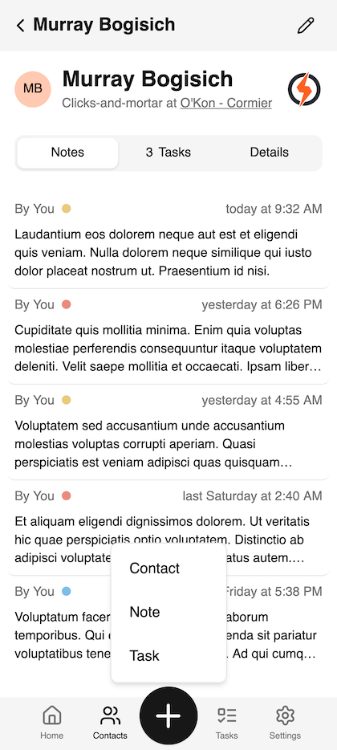
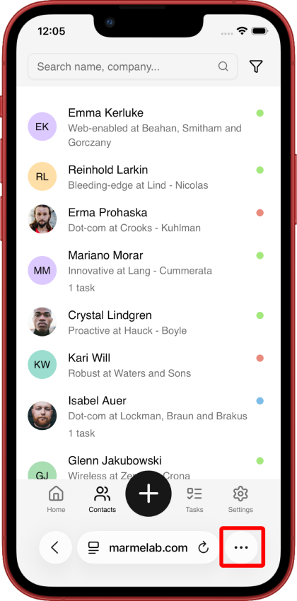
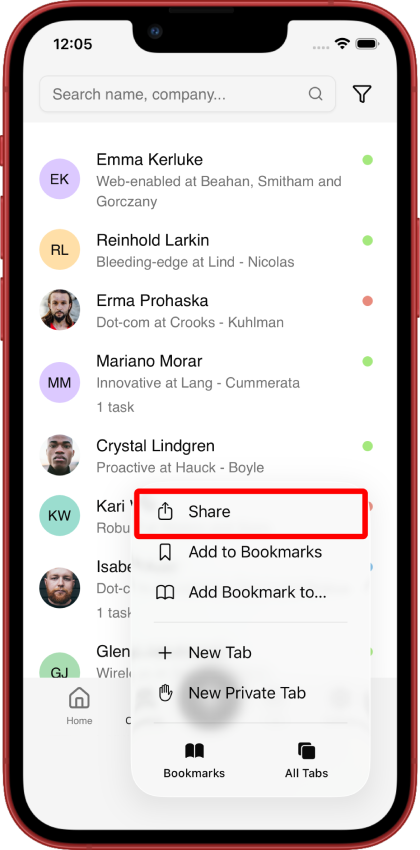
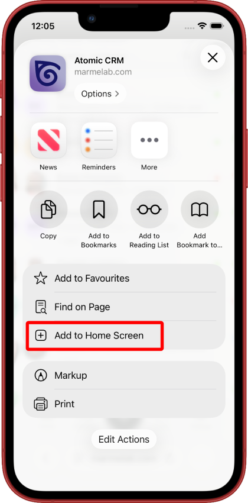
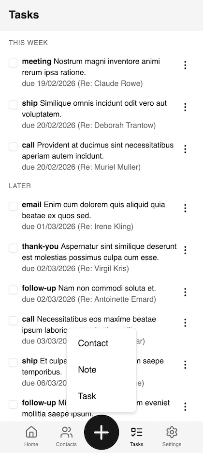
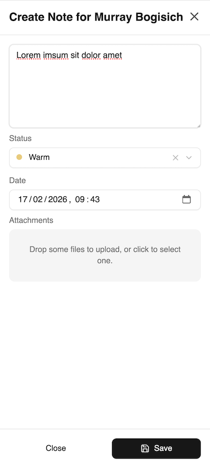
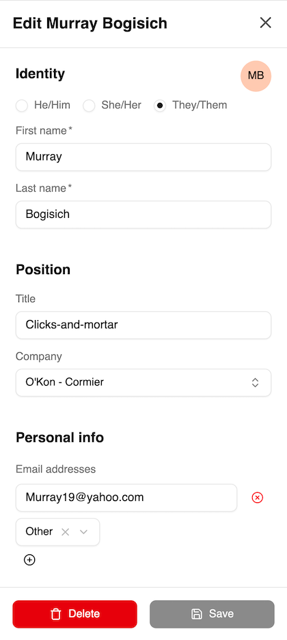

Atomic CRM also comes as a mobile application, allowing you to access your CRM data and perform actions on the go. 

|  |  | | 
| -- | -- | -- |
|  |  |  |

## Installation

Atomic CRM is actually a Progressive Web Application (PWA). This means that you can install it on your mobile device directly from your web browser. 

To do so, simply open your Atomic CRM instance in your mobile browser and look for the "Share / Add to Home Screen" option in the browser menu. Follow the prompts to install the app on your device.

|  |  | | 
| -- | -- | -- |
|  |  |  |

Then, you can open the app from your home screen and log in with your Atomic CRM credentials to access your data.

The app will auto-update whenever we release new features or improvements, so you will always have the latest version without needing to manually update it.

## Usage

The mobile app contains a subset of the features available in the web application, optimized for mobile use.

You can view and manage your contacts, tasks, and notes from the app. When adding notes, you can take advantage of the mobile device's camera to attach photos to your notes, and the microphone to use voice input.

|  |  | | 
| -- | -- | -- |
|  |  |  |

## Offline Mode

The mobile app also supports offline mode, allowing you to access your data even when you don't have an internet connection. 

:::note
In offline mode, you will only be able to access data that has been previously loaded while you were online. This includes your contacts, tasks, and notes. 
:::