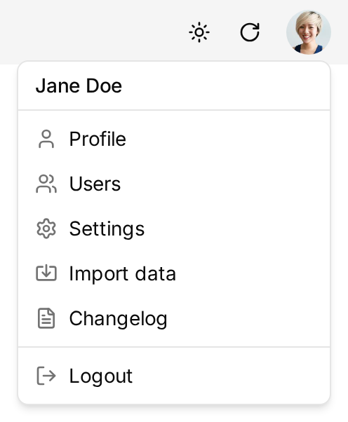
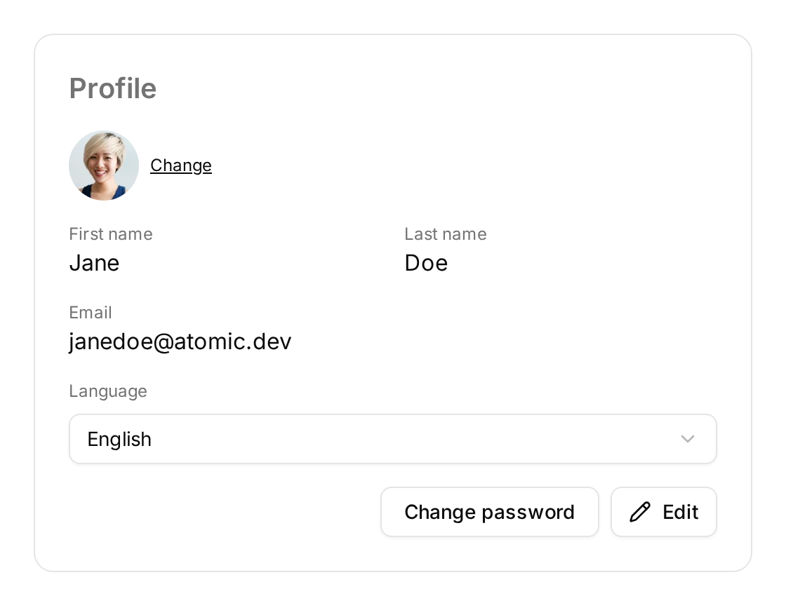
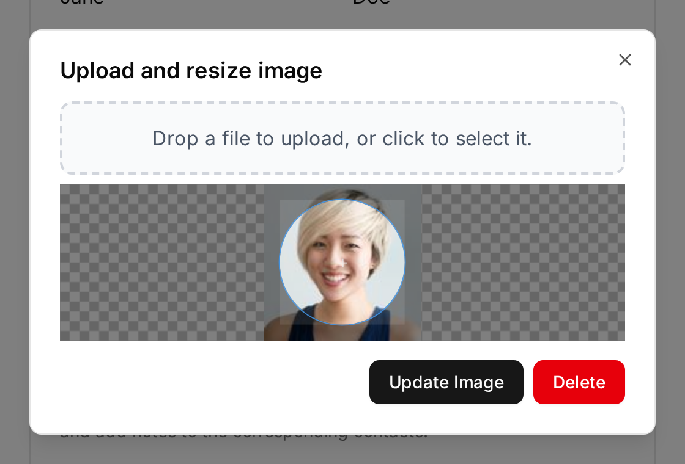
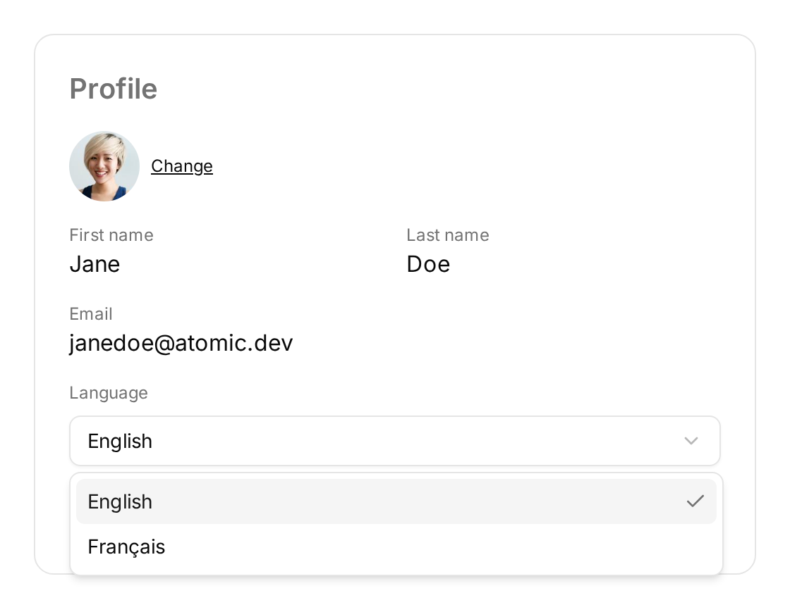

Every user can adjust their own account from the Profile page: avatar, name, email address, interface language, and password. These preferences only affect your own account. To change settings shared by the whole team (deal stages, note statuses, application name, etc.), see [Application Settings](../../users/settings) instead.

## Accessing Your Preferences

Click on your profile picture in the top right corner of the application, then select "Profile" in the dropdown menu.

The Profile page gathers all your personal preferences.

## Changing Your Avatar

Click on your avatar, or on the "Change" link next to it, to open the image editor.

Drop a JPEG or PNG file on the dashed area (or click it to pick a file), drag the circle to frame the picture, then click "Update Image". The "Delete" button removes your current picture.

The new avatar is saved immediately: you don't need to click "Edit" or "Save".

## Changing Your Name and Email

Click the "Edit" button, update the "First name", "Last name", and "Email" fields, then click "Save".

Your email address is also your login: once changed, sign in with the new address. It is also where Atomic CRM sends password reset and invitation emails.

## Changing Your Language

Pick a language in the "Language" selector. The interface switches immediately, and there is nothing to save.

Atomic CRM ships with English and French. The first time you open the application, the language is guessed from your browser settings, and falls back to English. Your choice is then remembered by your browser, so you may need to set it again on another computer, in another browser, or after clearing your browsing data.

The selector is hidden when the application is configured with a single language. To translate Atomic CRM into another language, see [Languages (i18n)](../../developers/customizing#languages-i18n) in the developer documentation.

## Changing Your Password

Click the "Change password" button: Atomic CRM sends a reset password email to your address. Follow the link in that email to choose a new password.

## Preferences on Mobile

On a mobile device, these preferences live in the Settings tab of the bottom navigation bar (see [Mobile App](../../users/mobile-app)):

- The "Profile" section holds your avatar, first name, last name, and email. Tap a row to edit it; each change is saved as soon as you validate it.
- The "Preferences" section holds the language selector and a system/light/dark theme switch.
- The "Change password" button sits at the bottom of the page, next to "Log out".

On desktop, the system/light/dark theme is switched with the sun/moon button in the top right corner of the application, next to your profile picture.
