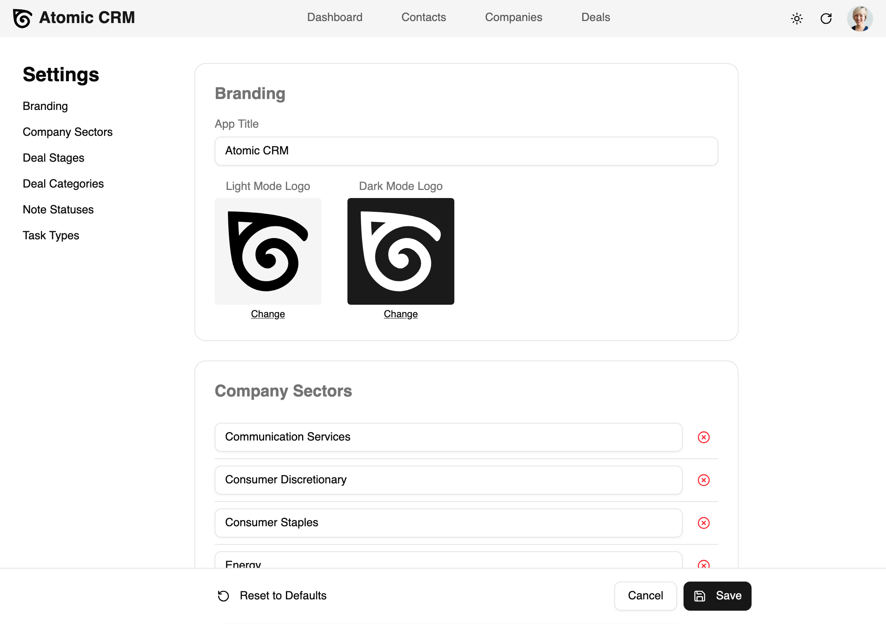

Admin users can configure various aspects of Atomic CRM to tailor the application to their specific needs. This includes customizing the user interface, defining categories, etc. 

## Accessing the Settings Page

If you're logged in as an admin user, you can access the configuration page by clicking on your profile picture in the top right corner of the application and selecting "Settings" from the dropdown menu. 

The settings page is organized into different sections, each corresponding to a specific aspect of the application that can be configured. You can navigate between these sections using the left sidebar.

## Changing Application Settings

The Settings page lets you customize:

- The application name and logo
- The company sectors
- The stages of the deal pipeline (e.g., prospecting, negotiation, closed-won, etc.)
- The deal categories
- The note statuses (hot, cold, etc.)
- The task types (call, email, etc.)

Once you save your changes, they will be immediately reflected across the application. For example, if you update the deal stages, the new stages will be available for users to drag and drop deals in the Kanban view, and they will also be available when creating or editing a deal.

When updating the name of an existing category (e.g., a deal stage), the new name will be applied to all existing records that belong to that category. For instance, if you rename the "Prospecting" deal stage to "Lead", all deals that were previously in the "Prospecting" stage will now be in the "Lead" stage.