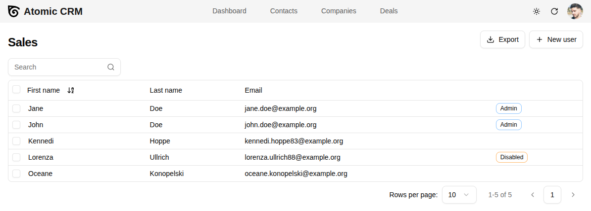

## Creating the First User

The first time you open the Atomic CRM App, you will be prompted to create the first user. This first user will automatically be granted administrator role.

<video src="https://github.com/user-attachments/assets/2e5fa809-bd46-4ea1-926f-6f53358de681" controls className="w-full aspect-884/724"></video>

Note: If the application is connected to the production database, the first user will need to validate their account by mail.

## Adding Users

Any user with the administrator role can create new users. To do this, click on the avatar in the top right corner and select 'Users'. From this page, you can add new users, edit existing users, and delete users.

