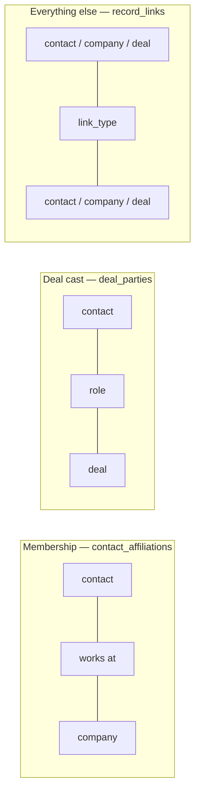
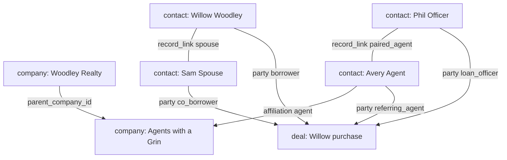
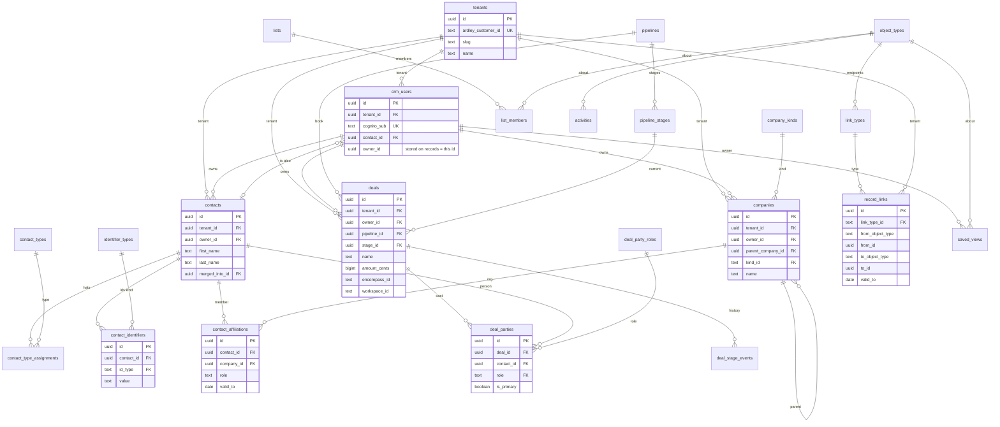

# Data model (as of W3)

Source of truth: [`schema-direction.sql`](schema-direction.sql). Plan invariants: [`poc-plan.md`](poc-plan.md) §17.

Rendered: [loan triangle](data-model-relationships.png) · [tables](data-model-er.png)

Every business table has `tenant_id` (Postgres UUID). Acorn isolation uses the Ardley customer id string (`100004` / `100081`). RLS is tenant-only; owner / branch / team stay in Acorn.

## Three kinds of relationship (do not collapse)

| Kind | Table | Examples | Not |
|---|---|---|---|
| Org membership | `contact_affiliations` | Avery is an agent at Agents with a Grin | `employed_by` on `record_links` |
| Deal cast | `deal_parties` | Willow is borrower on Willow purchase | `on_deal` as a link type |
| Durable graph | `record_links` | spouse, paired_agent, coach_of, referred_by, related_deal | org membership or deal roles |

Lists (`lists` + `list_members`) are **explicit sets**. Saved views are **stored queries**. Mixing them recreates HubSpot’s “this isn’t actually linked” problem.

## Loan triangle (what you click)

## Tables

`record_links.from_id` / `to_id` are polymorphic (typed by `object_types`). Reliability is the `link_types` catalog + tests, not a Postgres FK to one parent table.

## Catalogs already seeded

| Catalog | Values |
|---|---|
| `object_types` | contact, company, deal |
| `link_types` | spouse, paired_agent, coach_of, referred_by, related_deal |
| `contact_types` | borrower, potential_borrower, real_estate_agent, loan_officer, employee, recruit |
| `company_kinds` | brokerage, place_team, builder, employer, lender_branch |
| `identifier_types` | nmls, dre, mls, email, phone |
| `deal_party_roles` | borrower, co_borrower, referring_agent, loan_officer, recruit |

NMLS / DRE / email / phone live on the **contact**. Encompass / CES workspace ids live on the **deal**.

## Deliberately unused (columns exist)

- `contacts.branch_id` / `team_id` (and same on companies / deals) — for later Acorn scopes
- `company_tree` view — recursive parent walk
- `activities` / `deal_stage_events` — append-only; UI is still thin

## Not in this model

Household object (four contacts + spouse link instead). Company DAG. Atomic `sales` / `configuration` jsonb. Cascade-delete of people (`ON DELETE RESTRICT`).
