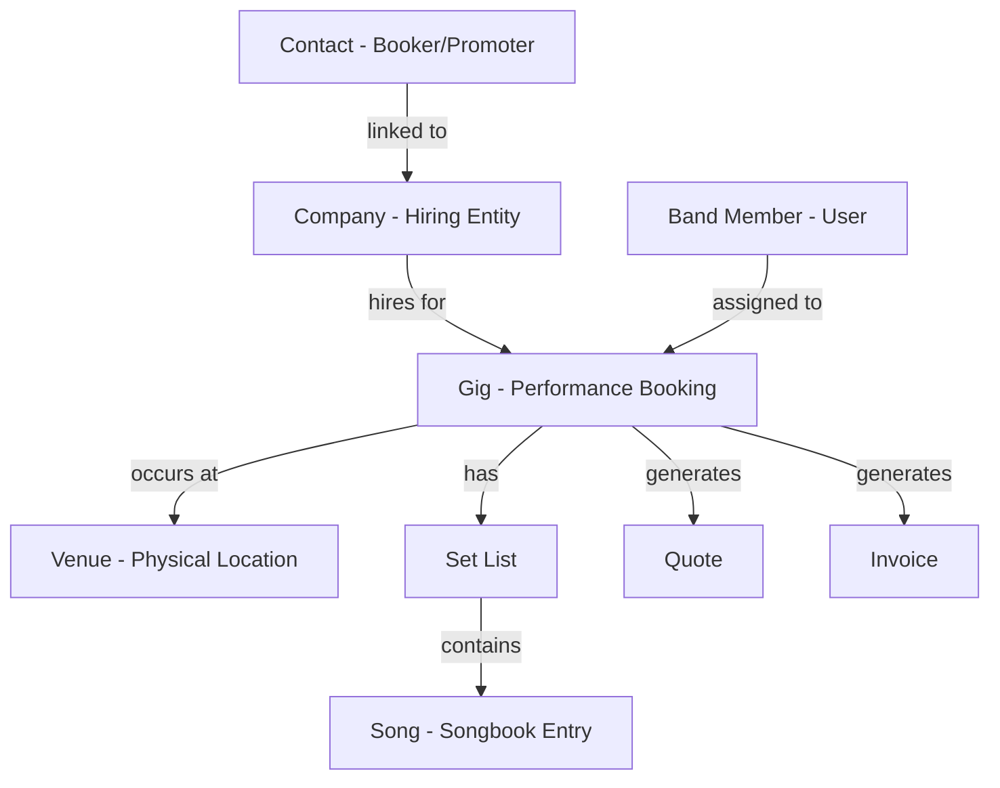

# Band CRM Implementation Plan

## Overview

This plan outlines the transformation of Atomic CRM into a Band Management CRM system. The implementation follows the specification in [`band-crm-spec.md`](../band-crm-spec.md) and leverages the existing Atomic CRM architecture.

## Key Terminology Mapping

| Atomic CRM | Band CRM | Description |
|------------|----------|-------------|
| Deal | Gig | Performance bookings with Kanban pipeline |
| Contact | Contact | Venue contacts, bookers, promoters |
| Company | Company | Hiring entity (promoter, agency, venue business) |
| Sale (user) | Band Member | Users of the application |
| — | **Venue** | **NEW**: Physical performance location |
| — | Song | **NEW**: Songbook entries |
| — | Set List | **NEW**: Ordered songs per gig |
| — | Quote | **NEW**: Generated from template |
| — | Invoice | **NEW**: Generated on gig completion |

## Architecture Diagram



---

## Phase 1: Database Schema

### 1.1 Create Venues Table
**File**: `supabase/migrations/YYYYMMDD_create_venues.sql`

Create a new `venues` table to store physical performance locations separate from companies.

**Key fields**:
- Basic info: name, address, city, postcode, country
- Technical: capacity, stage_size, parking_info, load_in_notes
- Contact: contact_name, contact_phone, contact_email
- Metadata: website, notes, timestamps

**Considerations**:
- Use UUID primary key for consistency
- Enable RLS with authenticated user policy
- Add indexes on name and city for search performance

### 1.2 Extend Deals Table for Gigs
**File**: `supabase/migrations/YYYYMMDD_extend_deals_for_gigs.sql`

Add gig-specific columns to existing `deals` table:
- `venue_id` (FK to venues) - where the gig happens
- `performance_date`, `start_time`, `end_time` - scheduling
- `set_count` - number of sets to perform
- `fee`, `deposit`, `deposit_paid` - financial tracking
- `travel_expenses` - additional costs
- `quote_sent_at`, `invoice_sent_at` - document tracking

**Important**: Keep `company_id` - this is the hiring entity (different from venue).

### 1.3 Create Gig Members Table
**File**: `supabase/migrations/YYYYMMDD_create_gig_members.sql`

Junction table linking band members to specific gigs:
- `gig_id` (FK to deals)
- `sales_id` (FK to sales/band members)
- `role` (e.g., "Lead Guitar", "Vocals", "Dep")
- `confirmed` (boolean)
- Unique constraint on (gig_id, sales_id)

### 1.4 Create Songs Table
**File**: `supabase/migrations/YYYYMMDD_create_songs.sql`

Songbook management:
- Basic: title, artist, genre
- Musical: key, tempo (BPM), duration (seconds)
- Resources: lyrics_url, chart_url
- Organization: tags (array), active (boolean)

### 1.5 Create Set Lists Tables
**File**: `supabase/migrations/YYYYMMDD_create_setlists.sql`

Two tables for set list management:
1. **set_lists**: Container for each set (Set 1, Set 2, etc.)
   - Links to gig_id
   - Has name and position
2. **set_list_songs**: Individual songs in a set
   - Links to set_list_id and song_id
   - Has position for ordering
   - Per-gig notes field

### 1.6 Create Quote Templates Tables
**File**: `supabase/migrations/YYYYMMDD_create_quote_templates.sql`

Template-based document generation:
1. **quote_templates**: Reusable templates
   - name, body_html (Handlebars template)
   - is_default flag
2. **gig_quotes**: Generated quotes per gig
   - Links to gig_id and template_id
   - rendered_html (final output)
   - sent_at, accepted_at timestamps
   - version tracking

### 1.7 Update Views
**File**: `supabase/migrations/YYYYMMDD_update_deals_summary_view.sql`

Extend `deals_summary` view to include venue information:
```sql
LEFT JOIN venues v ON d.venue_id = v.id
```
Add columns: venue_name, venue_city, venue_address

---

## Phase 2: TypeScript Types

### 2.1 Add New Types
**File**: [`src/components/atomic-crm/types.ts`](../src/components/atomic-crm/types.ts)

Add type definitions for:
- `Venue` - all venue fields
- `Gig` - extends Deal with venue and gig-specific fields
- `GigMember` - band member assignment
- `Song` - songbook entry
- `SetList` & `SetListSong` - set list structure
- `QuoteTemplate` & `GigQuote` - document templates

**Note**: The `Gig` type extends the existing `Deal` type to maintain compatibility.

---

## Phase 3: Venues Module

### 3.1 Create Venue Components
**Directory**: `src/components/atomic-crm/venues/`

**Files to create**:
- `VenueList.tsx` - List view with search and filters
- `VenueShow.tsx` - Detail page with gig history
- `VenueEdit.tsx` - Edit form
- `VenueCreate.tsx` - Create form
- `VenueInputs.tsx` - Shared form fields
- `VenueAside.tsx` - Sidebar with venue details
- `AutocompleteVenueInput.tsx` - Venue selector for gig forms
- `index.ts` - Exports

**Key features**:
- Search by name
- Filter by city
- Display capacity, stage size, technical info
- Show list of past/upcoming gigs at venue
- Map integration (optional enhancement)

### 3.2 Venue Form Fields
Fields to include in VenueInputs:
- Name (required)
- Address, City, Postcode, Country
- Capacity (number)
- Stage Size (text)
- Parking Info (textarea)
- Load-in Notes (textarea)
- Contact details (name, phone, email)
- Website
- General notes

---

## Phase 4: Songbook Module

### 4.1 Create Song Components
**Directory**: `src/components/atomic-crm/songs/`

**Files to create**:
- `SongList.tsx` - Searchable song library
- `SongShow.tsx` - Song detail view
- `SongEdit.tsx` - Edit form
- `SongCreate.tsx` - Create form
- `SongInputs.tsx` - Form fields
- `index.ts` - Exports

**Key features**:
- Search by title/artist
- Filter by genre, key, tags
- Sort by title, artist, duration
- Display duration in MM:SS format
- Link to lyrics/charts
- Active/inactive toggle

### 4.2 Song Form Fields
Fields in SongInputs:
- Title (required)
- Artist
- Key (dropdown: C, C#, D, etc.)
- Tempo (BPM, number)
- Duration (seconds or MM:SS input)
- Genre (text or dropdown)
- Tags (multi-select)
- Lyrics URL
- Chart URL
- Notes
- Active (checkbox)

---

## Phase 5: Gigs Module

### 5.1 Extend Deal Components
**Directory**: `src/components/atomic-crm/deals/` → Consider renaming to `gigs/`

**Files to modify/create**:
- Rename components: `DealList` → `GigList`, etc.
- Extend `DealInputs.tsx` → `GigInputs.tsx` with:
  - Company selector (hiring entity)
  - Venue selector (performance location)
  - Performance date/time fields
  - Fee, deposit, travel expenses
  - Set count
- Create `GigAside.tsx` - Sidebar with members, set lists, actions
- Update `DealShow.tsx` → `GigShow.tsx` to display venue info

**Key distinction**: 
- **Company** = who is hiring/paying the band
- **Venue** = where the performance happens

### 5.2 Gig Pipeline Stages
Update in [`src/App.tsx`](../src/App.tsx):
```typescript
dealStages={[
  { value: 'enquiry', label: 'Enquiry' },
  { value: 'quoted', label: 'Quoted' },
  { value: 'won', label: 'Won' },
  { value: 'confirmed', label: 'Confirmed' },
  { value: 'completed', label: 'Completed' },
  { value: 'lost', label: 'Lost' },
]}
```

---

## Phase 6: Set Lists Module

### 6.1 Install Dependencies
```bash
npm install @dnd-kit/core @dnd-kit/sortable @dnd-kit/utilities
npm install jspdf jspdf-autotable  # For PDF generation
```

### 6.2 Create Set List Components
**Directory**: `src/components/atomic-crm/setlists/`

**Files to create**:
- `SetListBuilder.tsx` - Main drag-and-drop interface
- `SetListSongItem.tsx` - Draggable song row
- `SongPickerDialog.tsx` - Modal to add songs from songbook
- `GigSetLists.tsx` - Container with tabs for multiple sets
- `SetListTemplateList.tsx` - Manage reusable set list templates
- `SetListTemplateEdit.tsx` - Edit template
- `CopySetListDialog.tsx` - Copy set list from another gig or template
- `index.ts` - Exports

**Key features**:
- Drag-and-drop reordering with @dnd-kit
- Add songs from songbook
- Remove songs from set
- Display total duration
- Per-song notes
- Multiple sets per gig (Set 1, Set 2, etc.)
- **Save as template** - Save current set list as reusable template
- **Copy from template** - Load songs from saved template
- **Copy from gig** - Copy set list from another gig
- Real-time persistence to Supabase

### 6.3 Set List Builder UX
- Visual feedback during drag
- Show song position numbers
- Display key and duration for each song
- Total set duration at top
- "Add Songs" button opens picker dialog
- Song picker filters out already-added songs

---

## Phase 7: Gig Members

### 7.1 Create Gig Members Component
**File**: `src/components/atomic-crm/gigs/GigMembers.tsx`

**Features**:
- List band members assigned to gig
- Add/remove members
- Show role (e.g., "Lead Guitar", "Dep")
- Confirmation toggle (checkmark icon)
- Dropdown to select from available band members
- Visual indicator for confirmed vs. unconfirmed

### 7.2 Integration
Add `<GigMembers />` to `GigAside.tsx` sidebar.

---

## Phase 8: Quote & Invoice System

### 8.1 Quote Generation
**File**: `src/components/atomic-crm/gigs/GigQuoteButton.tsx`

**Features**:
- Load default quote template
- Render Handlebars variables:
  - `{{gig_name}}`, `{{company_name}}`, `{{venue_name}}`
  - `{{performance_date}}`, `{{start_time}}`, `{{end_time}}`
  - `{{fee}}`, `{{deposit}}`, `{{set_count}}`
- Preview in dialog
- Save to `gig_quotes` table
- Update gig stage to "Quoted"
- Set `quote_sent_at` timestamp

### 8.2 Invoice Generation
**File**: `src/components/atomic-crm/gigs/GigInvoiceButton.tsx`

**Features**:
- Generate invoice HTML from gig data
- Include:
  - Invoice number (based on gig ID)
  - Company name (client)
  - Venue name and date
  - Fee breakdown
  - Deposit deduction (if paid)
  - Balance due
  - Payment terms
- Preview in dialog
- Print functionality
- Mark as sent (set `invoice_sent_at`)

### 8.3 Quote Templates Management
**Directory**: `src/components/atomic-crm/quotes/`

**Files to create**:
- `QuoteTemplateList.tsx` - List of templates
- `QuoteTemplateEdit.tsx` - Template editor
- `QuotePreviewDialog.tsx` - Preview with sample data
- `InvoicePreviewDialog.tsx` - Invoice preview
- `index.ts` - Exports

**Optional enhancement**: Rich text editor (TipTap) for template editing.

### 8.4 Supported Template Variables
Document these in the template editor UI:
- `{{gig_name}}` - Gig/booking name
- `{{company_name}}` - Hiring company
- `{{venue_name}}`, `{{venue_city}}`, `{{venue_address}}`
- `{{performance_date}}` - Formatted date
- `{{start_time}}`, `{{end_time}}`
- `{{fee}}`, `{{deposit}}`, `{{set_count}}`
- `{{contact_name}}` - Primary contact

---

## Phase 9: App Configuration

### 9.1 Update App.tsx
**File**: [`src/App.tsx`](../src/App.tsx)

Configure the CRM component:
```typescript
<CRM
  title="Band Manager"
  dealLabel={{ singular: "Gig", plural: "Gigs" }}
  companyLabel={{ singular: "Company", plural: "Companies" }}
  dealStages={[...]} // Gig pipeline stages
  extraResources={[
    {
      name: "venues",
      list: VenueList,
      edit: VenueEdit,
      create: VenueCreate,
      show: VenueShow,
      icon: Building2Icon,
      label: "Venues",
    },
    {
      name: "songs",
      list: SongList,
      edit: SongEdit,
      create: SongCreate,
      show: SongShow,
      icon: MusicIcon,
      label: "Songbook",
    },
    {
      name: "quote_templates",
      list: QuoteTemplateList,
      edit: QuoteTemplateEdit,
      icon: FileTextIcon,
      label: "Quote Templates",
    },
  ]}
/>
```

### 9.2 Update Navigation
Ensure the sidebar menu includes:
- Dashboard
- Gigs (formerly Deals)
- Contacts
- Companies
- **Venues** (new)
- **Songbook** (new)
- **Quote Templates** (new)
- Band Members (formerly Sales)
- Settings

### 9.3 Update Labels Throughout
Update terminology in UI only (keep database/code names):
- "Deal" → "Gig" in UI labels via `dealLabel` prop
- "Sale" → "Band Member" in UI labels
- Keep directory names as `deals/` and `sales/`
- Keep database column names unchanged for compatibility

---

## Phase 10: FakeRest Provider Updates

### 10.1 Add Venue Data Generator
**File**: `src/components/atomic-crm/providers/fakerest/dataGenerator/venues.ts`

Generate sample venues with realistic data:
- UK venue names
- Addresses in various cities
- Capacity ranges (50-500)
- Stage sizes
- Technical notes

### 10.2 Update Deals Generator
**File**: `src/components/atomic-crm/providers/fakerest/dataGenerator/deals.ts`

Add gig-specific fields:
- `venue_id` references
- Performance dates
- Times, fees, deposits
- Set counts

### 10.3 Add Song Data Generator
**File**: `src/components/atomic-crm/providers/fakerest/dataGenerator/songs.ts`

Generate sample songbook:
- Mix of covers and originals
- Various genres
- Realistic keys and tempos
- Duration ranges

### 10.4 Add Set List Template Generator
**File**: `src/components/atomic-crm/providers/fakerest/dataGenerator/setListTemplates.ts`

Generate sample set list templates:
- "Classic Rock Set"
- "Jazz Standards"
- "Wedding Reception"
- Each with 10-15 songs

### 10.5 Emulate Views
**File**: `src/components/atomic-crm/providers/fakerest/supabaseAdapter.ts`

Update the adapter to emulate `deals_summary` view with venue joins.

---

## Phase 11: Testing & Documentation

### 11.1 Unit Tests
Create test files:
- `src/components/atomic-crm/setlists/SetListBuilder.test.tsx` - Drag-and-drop logic
- `src/components/atomic-crm/gigs/templateRenderer.test.ts` - Handlebars rendering
- `src/components/atomic-crm/venues/VenueInputs.test.tsx` - Form validation

### 11.2 Integration Tests
Test key workflows:
- Create gig with company and venue
- Add band members to gig
- Build set list with drag-and-drop
- Generate quote and invoice
- Move gig through pipeline stages

### 11.3 Documentation Updates
Update files:
- `README.md` - Add Band CRM overview
- `AGENTS.md` - Update with new entities and workflows
- Create `doc/src/content/docs/band-crm/` directory with:
  - Getting started guide
  - Venue management
  - Songbook management
  - Set list builder
  - Quote/invoice generation

### 11.4 Seed Data
**File**: `supabase/seed.sql`

Add sample data:
- Default quote template
- Sample venues
- Sample songs
- Sample gigs with all relationships

---

## Implementation Order

The phases should be implemented in this order to maintain working functionality:

1. **Phase 1** (Database) - Foundation for all features
2. **Phase 2** (Types) - Required for TypeScript development
3. **Phase 3** (Venues) - Independent module, can be tested standalone
4. **Phase 4** (Songbook) - Independent module, can be tested standalone
5. **Phase 5** (Gigs) - Extends existing deals, depends on venues
6. **Phase 7** (Gig Members) - Depends on gigs
7. **Phase 6** (Set Lists) - Depends on gigs and songs
8. **Phase 8** (Quotes/Invoices) - Depends on gigs
9. **Phase 9** (App Config) - Wires everything together
10. **Phase 10** (FakeRest) - For demo mode
11. **Phase 11** (Testing) - Final validation

---

## Key Design Decisions

### 1. Company vs. Venue Separation
**Decision**: Keep company and venue as separate entities.

**Rationale**: 
- A promoter company may book gigs at multiple venues
- A venue business may be both the hiring company AND the venue
- This flexibility handles both scenarios

**Example scenarios**:
- Scenario A: "Red Lion Pub Ltd" (company) hires band to play at "The Red Lion" (venue)
- Scenario B: "Live Music Promotions" (company) hires band to play at "Jazz Cellar" (venue)

### 2. Extend Deals vs. Create New Table
**Decision**: Extend the existing `deals` table rather than creating a new `gigs` table.

**Rationale**:
- Maintains compatibility with existing Atomic CRM features
- Reuses deal pipeline, notes, activity log
- Simpler migration path
- Can still rename UI labels to "Gigs"

### 3. Set List Storage
**Decision**: Use three tables (set_list_templates + set_lists + set_list_songs) rather than JSON.

**Rationale**:
- Enables proper foreign key constraints
- Easier to query and report on song usage
- Better data integrity
- Supports reusable templates
- Supports copying between gigs
- Enables future features (e.g., "most played songs")

**Template System**:
- `set_list_templates` - Reusable templates (not linked to gigs)
- `set_lists` - Actual set lists for specific gigs
- `set_list_songs` - Songs in either templates or gig set lists
- Copy operation duplicates songs from template to gig

### 4. Quote/Invoice Template System
**Decision**: Use simple Handlebars-style string replacement rather than a full template engine.

**Rationale**:
- Simpler implementation
- Minimal dependencies
- Sufficient for initial requirements
- Can be enhanced later if needed

### 5. PDF Generation
**Decision**: Use jsPDF for client-side PDF generation.

**Rationale**:
- No server-side processing required
- Works with existing HTML templates
- Lightweight library
- Good browser support
- Users can download PDFs directly

---

## Migration Strategy

### For Existing Atomic CRM Installations

If migrating an existing Atomic CRM instance:

1. **Backup database** before running migrations
2. **Run migrations in order** - they're designed to be non-destructive
3. **Existing deals** will continue to work (venue_id will be NULL)
4. **Gradually populate** venue data and link to gigs
5. **UI labels** change but data structure remains compatible

### For New Installations

1. Run all migrations from scratch
2. Use seed data to populate sample content
3. Start with demo mode (FakeRest) to explore features

---

## Risk Mitigation

### Potential Issues

1. **Database migration failures**
   - Mitigation: Test migrations on local Supabase first
   - Always backup before production migrations

2. **Performance with large songbooks**
   - Mitigation: Add indexes on frequently searched fields
   - Implement pagination in song picker

3. **Drag-and-drop browser compatibility**
   - Mitigation: @dnd-kit has good browser support
   - Test on target browsers early

4. **Template rendering edge cases**
   - Mitigation: Handle missing variables gracefully
   - Provide default values for all template variables

---

## Success Criteria

The implementation is complete when:

- ✅ All database migrations run successfully
- ✅ All new TypeScript types compile without errors
- ✅ Venues can be created, edited, listed, and linked to gigs
- ✅ Songs can be managed in the songbook
- ✅ Gigs can be created with both company and venue
- ✅ Band members can be assigned to gigs
- ✅ Set lists can be built with drag-and-drop
- ✅ Quotes can be generated from templates
- ✅ Invoices can be generated and printed
- ✅ All features work in both Supabase and FakeRest modes
- ✅ Unit tests pass
- ✅ Documentation is updated

---

## Next Steps

After reviewing this plan:

1. **Clarify any questions** about the approach
2. **Adjust priorities** if needed
3. **Switch to Code mode** to begin implementation
4. **Start with Phase 1** (Database Schema)

---

## Decisions Made

Based on review discussion, the following decisions have been finalized:

1. ✅ **Naming**: Keep `deals/` directory name, change UI labels only via props
2. ✅ **Company/Venue UX**: Side-by-side selectors in gig form
3. ✅ **Set List Features**:
   - Reusable set list templates
   - Copy set list from templates or other gigs
   - Per-gig set lists with template support
4. ✅ **Document Output**:
   - HTML preview
   - PDF generation using jsPDF
   - Download and print functionality
5. ✅ **Permissions**: No special permissions - all band members have same access
6. ✅ **Mobile**: Standard mobile support (responsive design, touch-friendly)

## Ready for Implementation

The plan is now finalized and ready for implementation. Switch to Code mode to begin with Phase 1 (Database Schema).
